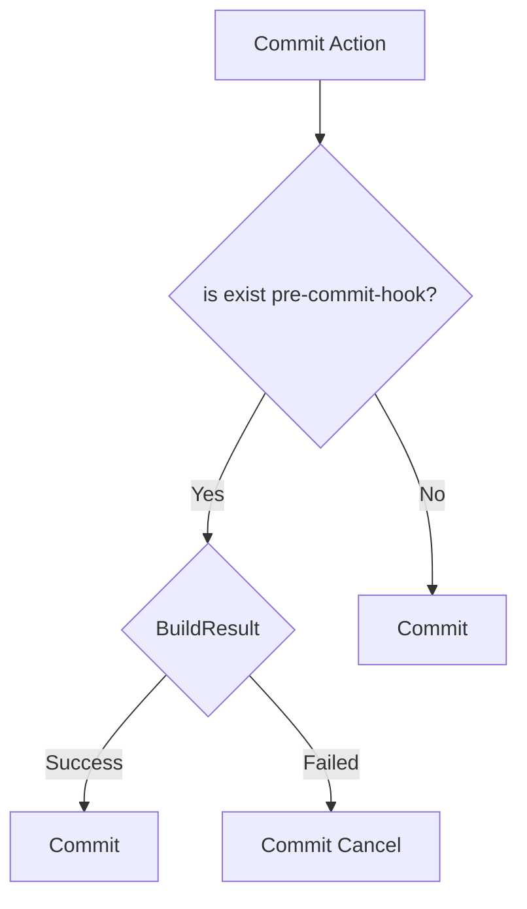

- pre-commit フックを使用して、ビルドの通らないコミットを封じる



- git/hook 配下に pre-commit スクリプトを配置する

```
#!/bin/sh


echo "dotnet build"

dotnet clean; dotnet build HelloWorld/HelloWorld.csproj
rc=$?

if [[ $rc != 0 ]] ; then
    echo -e "build failed"
    exit $rc
fi

exit 0
```

■ メリット

- Git ホスティングサーバーにビルド環境不要
- コミットログが汚れない

■ デメリット

- 大規模開発で雑なコミットが出来ない
- コミットに時間が掛かる

* クライアントサイドフックなので、リポジトリの管理ファイルに含まれない(コントリビューターに強制できない)

■ 参考

- ビルド成功


- ビルドエラー


