# mermaid でグラフを図表を描画する

VisualStudioCode で Marmaid 記法をプレビューできるツールをインストールします。  

また、mermaid 記法の視認性を上げるためにシンタックスハイライトツールもインストールします。

以下は公式ドキュメント抜粋。

■ フローチャート

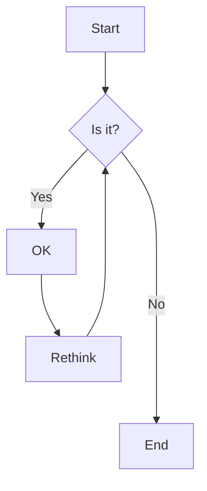

■ シーケンス図

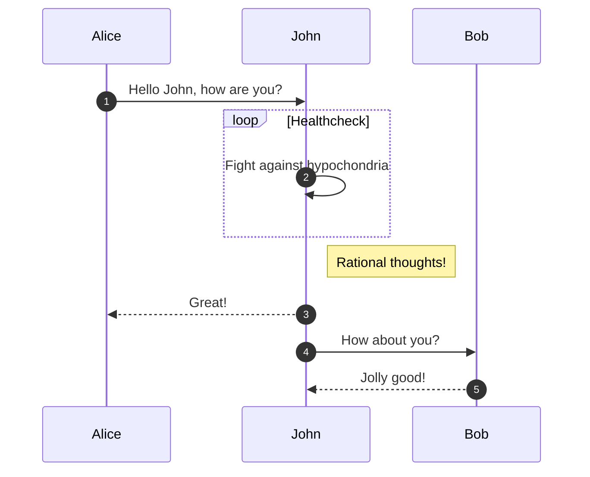

■ クラス図

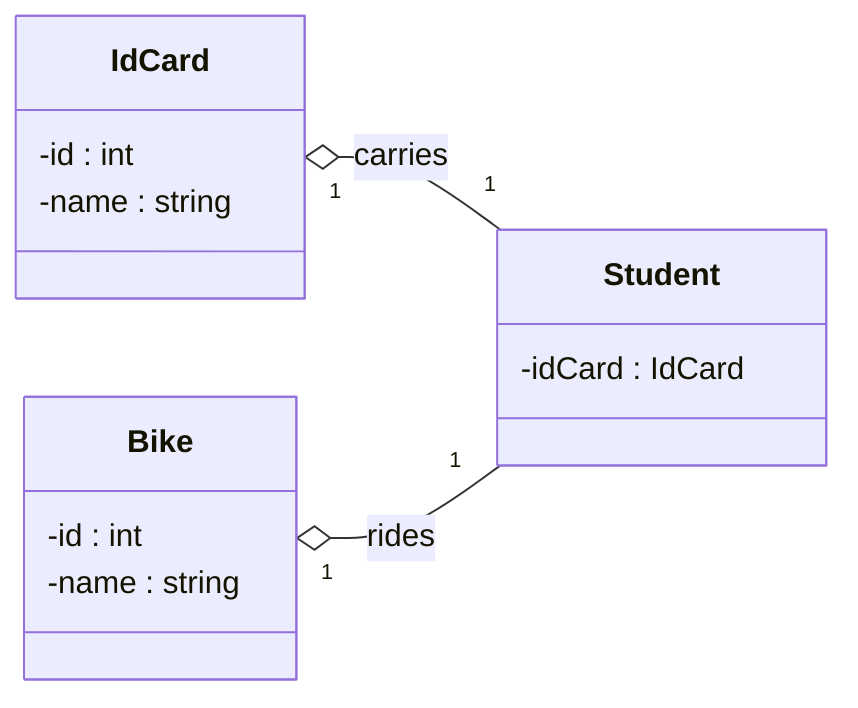

■ 状態遷移図

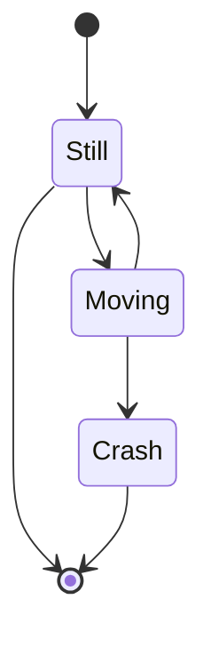

■ エンティティ関係図

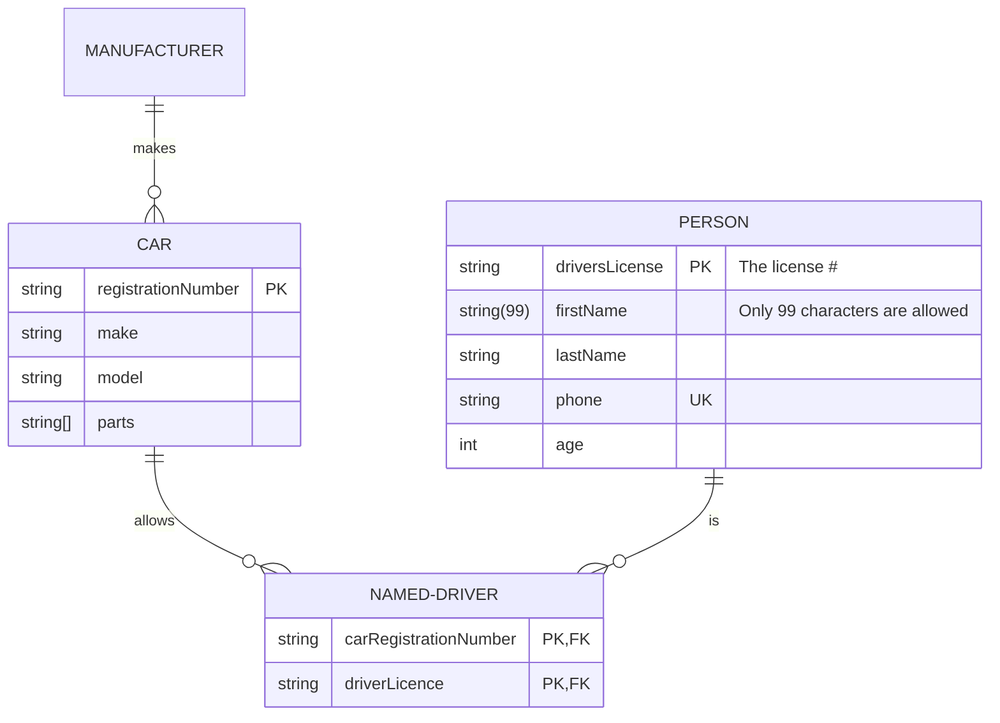

■ ユーザージャーニー図

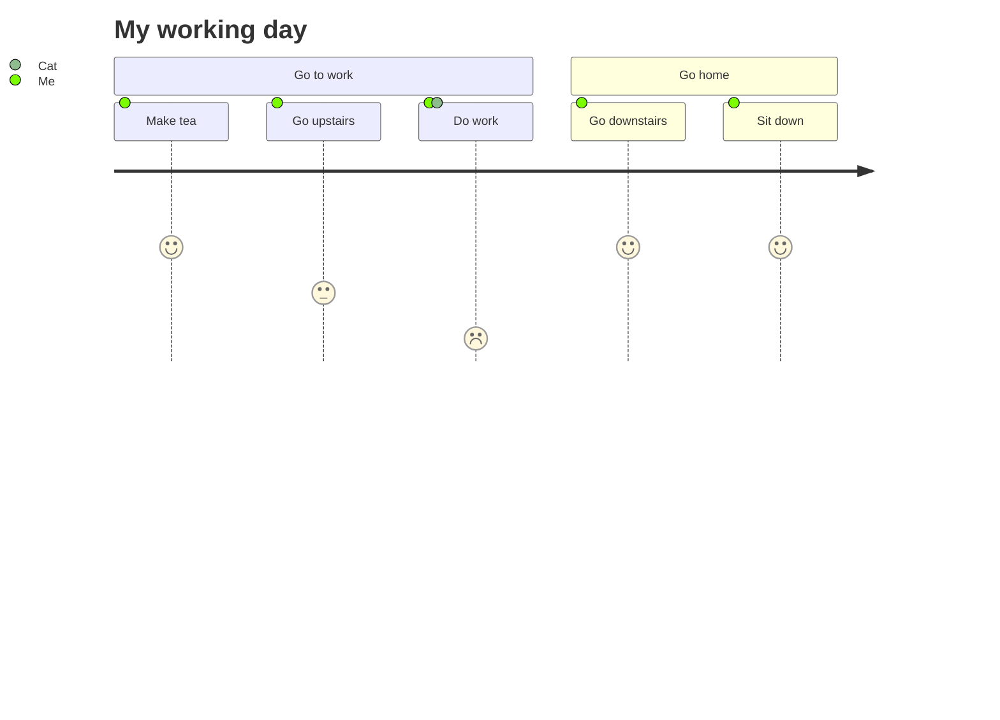

■ ガントチャート

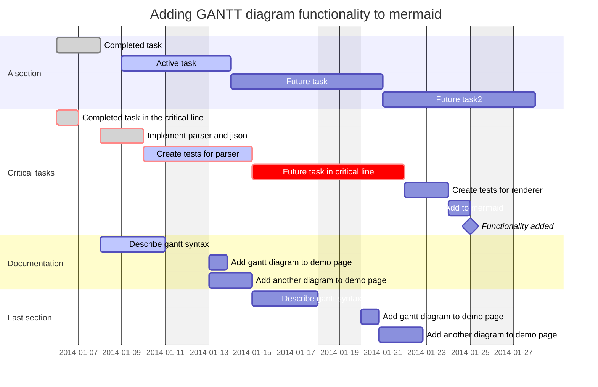

■ 円グラフ

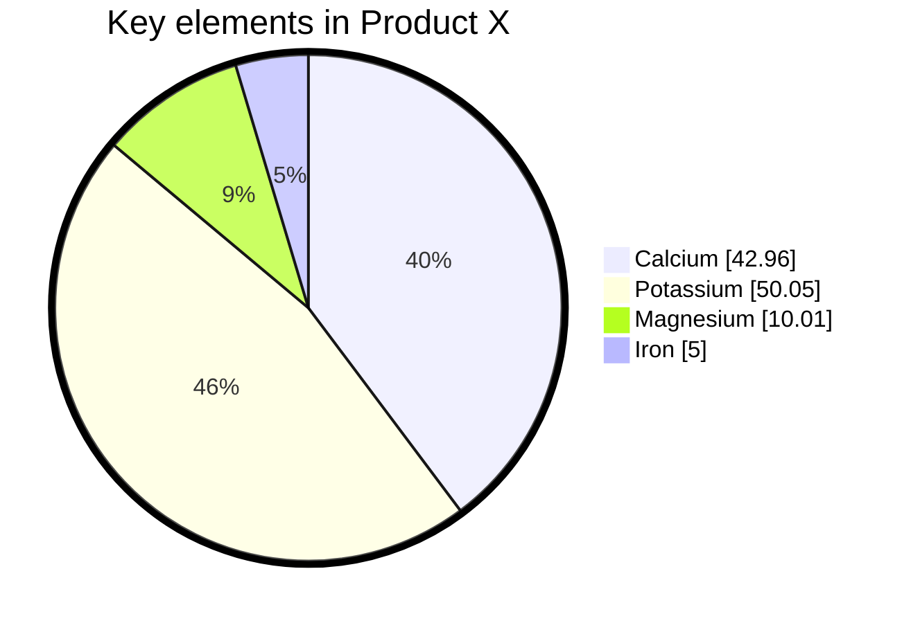

■ 要件図

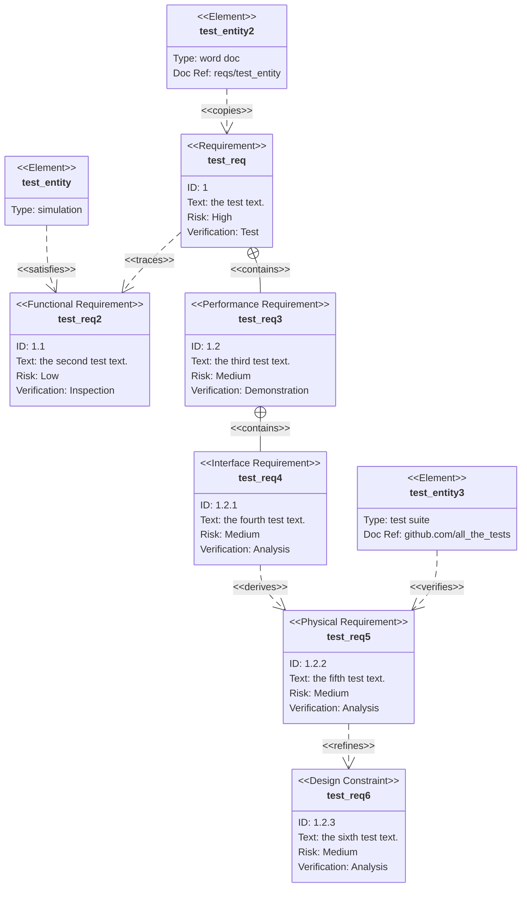

■ Gitgraph ダイアグラム

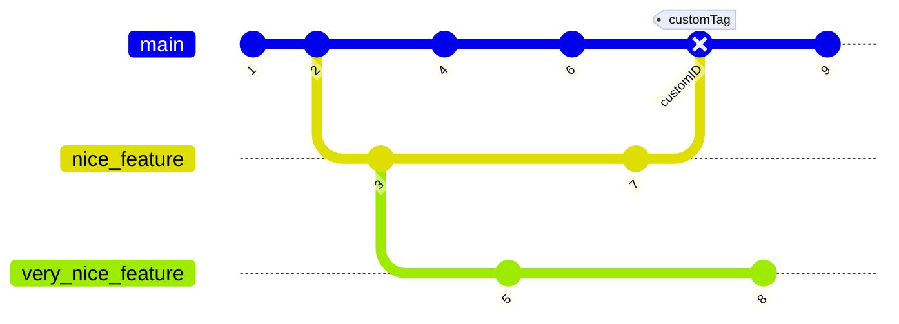

■C4 ダイアグラム

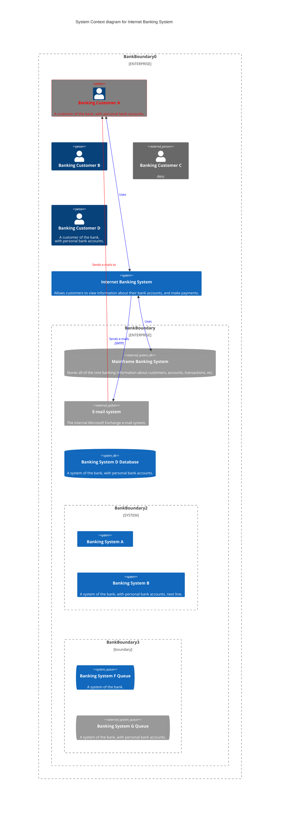

■ マインドマップ

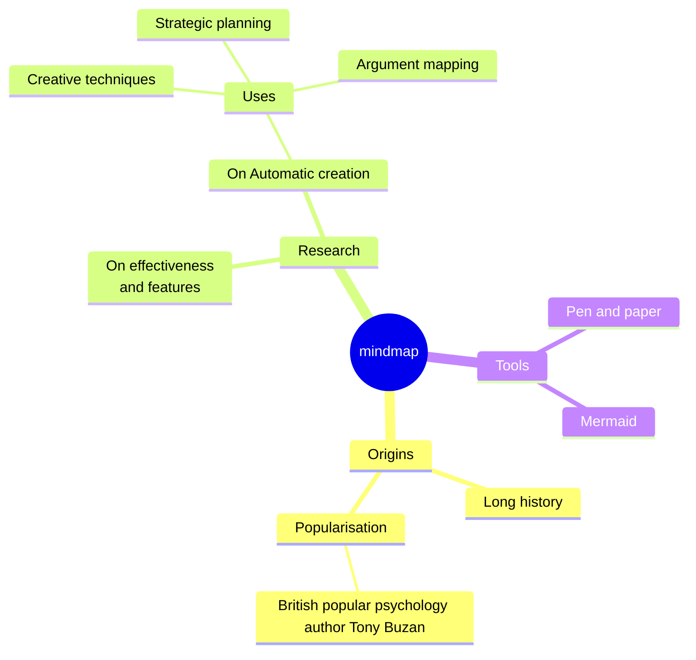

■ タイムライン

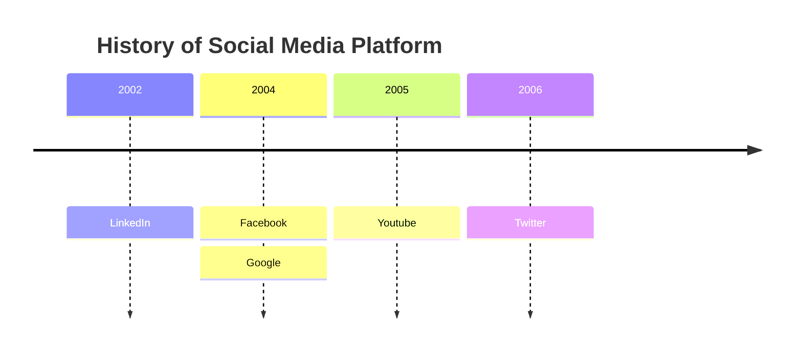
