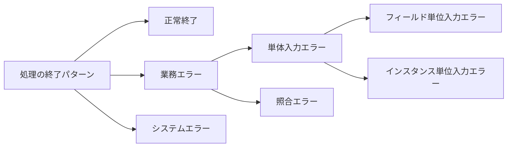

# C#ユーザーのための Web アプリ開発パターン

## ASP.NET Core Blazor の概要

- Blazor Server:通信回線が安定しているイントラネット業務アプリ(動作するためには常に SignalR でサーバと通信出来ている必要がある)

  - Blazor Web App テンプレートの Server+Global モデルを利用
  - 全てのページで InteractiveServer モデルを利用
  - SEO 対策が不要なため、プリレンダリング機能を無効化
  - アプリから直接 DB クエリを発行できる
  - Web-DB アプリを非常に高い生産性で開発可能

  * Web サーバプロセスのリサイクリングに弱い(Azure Web App のメンテ等)
  * 開発生産性が高い

  * 基本的にサーバーを複数台用意する必要がある。HTTP リクエストが同一のサーバに振り分けられるようにする

- Blazor WASM:オフライン稼働も必要になる業務アプリ
  - Blazor WebAssembly アプリテンプレートを使い、PWA として開発
  * 全てのページで InteractiveServer モデルを利用
  - ブラウザ駆動のため、プリレンダリング機能は利用されない
  - アプリから利用される WebAPI は別途開発
  - Web テクノロジーを利用しながらローカル稼働するアプリを開発可能

* Blazor United:インターネット向け B2C アプリ
  - Blazor Web App テンプレートの Server/WASM + per page モデルを利用
  - 個々のページの要件にあわせて Static SSR, Server, WASM を使い分ける
  - 開発の複雑化を避けるため、必要がない限り、Auto のページを避ける
  - SEO 最適化のため、プレレンダリング機能は有効な状態で開発する
  - 高機能・高速なインターネット向け Web アプリを効率的に開発できる
  * 高機能だがその分バグを埋め込みやすいため、必要がない場合は使用しない

## 処理結果の分類



- システムラー・・・DB アクセス不可。メモリ不足等。集約例外ハンドラで実装。
- 単体入力エラー・・・ユーザーの入力値のみで判定可能。データアノテーションフレームワークで実装。
- 照合エラー・・・データベースなど他の情報との突合せで判定可能。通常のイベントハンドラを使って実装。

## 構成設定

- DB や WebAPI への接続文字列は構成設定機能を用いてプログラムコードの外で管理
- 通常は、appsettings.json に切り出して管理
- 秘匿性を要求される情報は、開発環境であればユーザーシークレットを、運用環境であれば環境変数を用いて管理

## 集約例外

- appsettings.Development では`"DetailedErrors":  true,`がお勧め

* 未処理例外発生時に例外オブジェクトをログするためにカスタムロガーを作成し、サービスとして登録することを推奨
* ErrorBoundary の使用は非推奨。CSS によるスタイル変更がお勧め
* 'app.UseExceptionHandler'はデフォルトで有効だが、これは ASP.NET Core の HTTP 処理に対する例外ハンドラで Blazor 側で発生した例外については機能しない
* 未処理例外発生時はアプリの再起動を促す

## データモデルの作成

- アノテーションと FluentAPI を相互補完で使用するのが一般的
- LINQ は埋め込み式ではなく拡張方式を使用する（可読性のため）
- DbContext は AddDbContext ではなく、DbContext は AddDbContextFactory(都度生成)を用いる

* DbContext のオプション `EnableSensitiveDataLogging`や`EnableDetailedErrors`は開発環境でのみ推奨
* SQL Server の場合、変換デッドロックを避けるには`WITH(UPLOCK)`を取得する必要があるが、EF Core では簡単に指定する方法がないので`FromSqlRaw()`メソッドを使う必要がある
* EF Core はエンティティ単位のデータ出し入れを念頭に作られている
* 自動リトライ機能を使用する場合、クエリが冪等である必要がある

## Blazor Server によるアプリ開発

- OnInitialize メソッド等の後に画面を更新したい場合は戻り値を Task にする。Blazor ランタイムは Task オブジェクトを検知して画面再描画する

## Blazor WASM の概要

- 「Blazor WebAssembly アプリ」プロジェクトテンプレートを利用する方法（ブラウザ完結型）

  - WASM を開発するためのプロジェクトが作成される
  - 静的 Web サーバ上にアプリバイナリが配置されて実行される

- 「Blazor Web App」プロジェクトテンプレートを利用する方法(Server・WASM 混在型。難易度が高い。)
  - Web サーバとして Kestrel を使用する
  - Kestrel サーバのプロジェクトの横に、WASM 開発用プロジェクトが作成される

## Blazor WASM 型アプリで利用できる DI サービス

| サービス                                      | 内容                                             | Server | WASM |
| --------------------------------------------- | ------------------------------------------------ | ------ | ---- |
| IHostingEnvironment,IHostEnvironment          | ホストプロセスに関する情報を提供                 | 〇     | ×    |
| IWebAssemblyHostEnvironment                   | WASM ホストに関する情報を提供                    | ×      | 〇   |
| IConfiguration                                | 構成設定に関する情報を提供                       | 〇     | 〇   |
| ILogger,ILoggerFactory                        | ロギングを行うサービス                           | 〇     | 〇   |
| HttpClient,IHeetpContextFactory               | コンテキスト情報を保持するサービス               | 〇     | 〇   |
| NavigationManager                             | 画面遷移を行うサービス                           | 〇     | 〇   |
| DbContext, DbContextFactory                   | DB アクセスを行うサービス                        | 〇     | ×    |
| IJsRuntime                                    | JavaScript を呼ぶ出すサービス                    | 〇     | 〇   |
| ProtectedLocalStorage,ProtectedSessionStorage | セッションデータや永続化データを保持するサービス | 〇     | ×    |

- Wab API アクセスに使用する HttpClient の取り扱い
  - プロジェクトテンプレートは「同一オリジンへのリクエストしかできない」「appsettings.json の切り出しが出来ていない」「HTTP リトライ機能がない」といった問題がある
  - 名前付き HttpClient を使用することで複数の種類の HttpClient を使い分けできる
  - Polly と呼ばれるモジュールを使用して、冪等な WebAPI に対して自動リトライができる

```C#
string? baseAddress = builder.Configuration.GetValue<string>("BaseUrl");
if (baseAddress == null) baseAddress = builder.HostEnvironment.BaseAddress;

// 名前付きの HttpClient を定義する
builder.Services.AddHttpClient("HttpClientWithRetry", client => client.BaseAddress = new Uri(baseAddress))
    .AddPolicyHandler(msg =>
    {
        return HttpPolicyExtensions
            .HandleTransientHttpError() // 408, 5xx エラー
            .OrResult(msg => msg.StatusCode == System.Net.HttpStatusCode.NotFound) // 404 エラー
            .OrResult(msg => msg.StatusCode == System.Net.HttpStatusCode.Unauthorized) // 401 エラー
            .WaitAndRetryAsync(6, retryAttempt => TimeSpan.FromSeconds(Math.Pow(2, retryAttempt))
			+ TimeSpan.FromMilliseconds(Random.Shared.Next(0, 100)),
                onRetry: (response, delay, retryCount, context) =>
                {
                    Console.WriteLine($"Retrying: StatusCode: {response.Result.StatusCode} Message:
			{response.Result.ReasonPhrase} RequestUri: {msg.RequestUri}");
                });
    });

// 既定の HttpClient の挙動を変更する
builder.Services.Configure<Microsoft.Extensions.Http.HttpClientFactoryOptions>(options =>
{
    options.HttpClientActions.Add(client =>
    {
        client.BaseAddress = new Uri(baseAddress);
    });
});
```

```C#
@inject IHttpClientFactory httpClientFactory

@code {
    protected async Task GetData()
    {
        var httpClient1 = httpClientFactory.CreateClient();
        var httpClient2 = httpClientFactory.CreateClient("HttpClientWithRetry");
        ...
    }
}
```

- Blazor WASM ではセッションストレージが使用できないため、JavaScript 経由で使用する  
  または、起動時のみ記憶しておくだけでよければ、static 変数を利用する  
  OSS の BlazoredSessionStrage は Blazor Server と Blazor WASM 両方で使用できる

* Blazor WASM は appsettings.json がユーザーから丸見えになるのでセキュリティに対する配慮が必要
  埋め込みアセンブリファイル化することで丸見えにならずに済む。ただし、頑張れば解析できるので秘匿情報は含めないようにする。

  ```C#
  var builder = WebAssemblyHostBuilder.CreateDefault(args);
  builder.RootComponents.Add<App>("#app");
  builder.RootComponents.Add<HeadOutlet>("head::after");

  var stream = System.Reflection.Assembly.GetExecutingAssembly().GetManifestResourceStream("BlazorApp1.appsettings.json");
  builder.Configuration.AddJsonStream(stream);

  builder.Services.AddScoped<HttpClient>(sp => new HttpClient { BaseAddress = new Uri(builder.HostEnvironment.BaseAddress) });

  await builder.Build().RunAsync();
  ```

* WASM の場合、例外ログは一旦ローカルストレージに保存してから送信する

### Blazor Web App テンプレート作成オプション

| Interactive render mode | Static SSR | Server | WASM | Auto |
| ----------------------- | ---------- | ------ | ---- | ---- |
| None                    | 〇         | ×      | ×    | ×    |
| Server                  | 〇         | 〇     | ×    | ×    |
| WebAssembly             | 〇         | ×      | 〇   | ×    |
| Auto                    | 〇         | 〇     | 〇   | 〇   |

- Interactive render mode として WASM を利用するタイプを選択するとプロジェクトが２つになる。それ以外は１つ。
- Interactive render mode として Server を利用するタイプを選択すると、`Program.cs`で Interactive Server を利用するためのサービスやモジュールが追加される
- Interactive render mode として WASM を利用するタイプを選択すると、`Program.cs`で Interactive WebAssembly を利用するためのサービスやモジュールが追加される
- Interactive location として Global を指定した場合は、`App.razor`の`<HeadOutlet>`と`<Routes>`に規定のレンダリングモードが指定される
- Interactive location として Per Page/component を指定した場合には、個々のファイルで必要に応じて指定する

* Interactive WebAssembly におけるサーバ側プリレンダリングは、WASM 用に作られたページがブラウザ内だけでなくサーバ側でも動作してしまう(OnInitialize)弊害がある
  SEO 対策が不要ならサーバ側プリレンダリングは切った方が良い

### Blazor United におけるレンダリングモード選択の考え方

- 親ページを常に Static SSR に固定する戦略  
  画面全体については常に Static SSR にして画面上で対話型処理を必要とする部分を適宜切り出して Interactive Server/WASM/Auto コンポーネントとして実装する  
  ある程度の規模で開発する場合は、コンポーネントの切り出し方やレンダリングモードの指定方法を標準化する必要がある

  ### 認証・認可

  | アーキテクチャスタイル   | Blazor Server                                                       | Blazor WASM           | Blazor United                                                                 |
  | ------------------------ | ------------------------------------------------------------------- | --------------------- | ----------------------------------------------------------------------------- |
  | プロジェクトテンプレート | Blazor Web App                                                      | Blazor WebAssembly    | Blazor Web App                                                                |
  | プロジェクトオプション   | ` Interactive render mode = Server``Interactive location = Global ` | -                     | ` Interactive render mode = Auto``Interactive location = per page/component ` |
  | Web アプリとしての動き   | サーバーサイド型 Web アプリ                                         | SPA 型 Web アプリ     | 混合型                                                                        |
  | 認証・認可方法           | ASP.NET Core Web アプリと同様                                       | MSAL を組み込んで利用 | サーバー側の認証結果を WASM 側に共有して利用                                  |

  | アーキテクチャスタイル | 認証方式                   | 適したケース       |
  | ---------------------- | -------------------------- | ------------------ |
  | Blazor Server 型       | Windows 統合認証           | 社内イントラアプリ |
  | Blazor Server 型       | ME-ID(AAD)認証             | 社内イントラアプリ |
  | Blazor WASM 型         | ME-ID(AAD)認証             | 社内 PWA アプリ    |
  | Blazor United 型       | ASP.NET Core Identity 認証 | B2B/B2C アプリ     |

  ### その他

  - [Inject]だと null 警告が出るため@inject を推奨。どうしても[@Inject]が使いたい場合は、 = null!;で初期化
