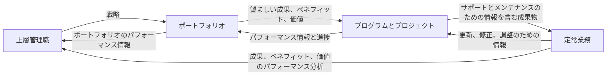
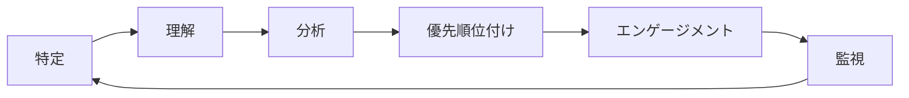
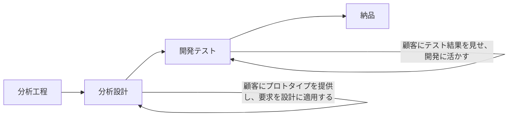
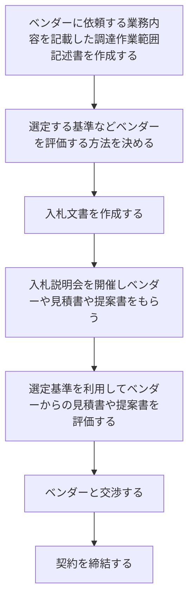
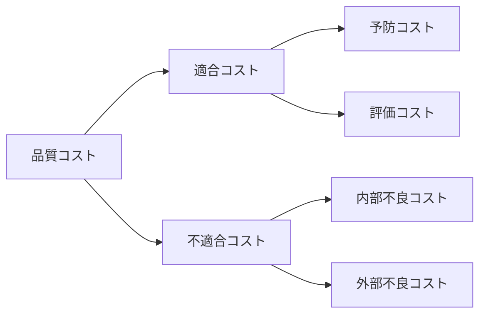

## 1 章　プロジェクトの基本

### PMBOK Guide

- PMBOK Guide 第 7 版は、プロジェクトマネジメントにおけるあらゆる開発アプローチの共通点を８つのパフォーマンス領域にまとめた概要書

### プロジェクトの定義

- プロジェクトとは、独自所産を創造するために実施する、有機性のある業務のこと

### プロジェクトにおけるその他の要素

- PRINCE2 とは、業務範囲が明確なプロジェクトマネジメント手法
- PRINCE2 では有機性と独自性のほか、機能横断、リスク、変化という要素がある

### 定常業務とプロジェクトの違い

| 特性     | 定常業務                                                                       | プロジェクト                                                           |
| -------- | ------------------------------------------------------------------------------ | ---------------------------------------------------------------------- |
| 有期性   | 特段の納期はなく、原則として安定した日々の業務を行う                           | 納期が存在し、納期までに全作業を完了させる必要があり、結果が求められる |
| 独自性   | 継続的な生産を行うため、製造する製品に独自性はない                             | 顧客などの要望に合わせて開発するため、開発する製品には独自性がある     |
| 機能横断 | 組織化された、業務に精通した専門集団が作業を行う                               | 多くの異なるスキルを持つ人が各部署から集められる                       |
| リスク   | 日々の業務が安定しているため、何かしらに影響を与えうる潜在的なリスクがほぼない | リスクが多いため、リスクヘッジが求められる                             |
| 変化     | 組織に対して大きな影響を与えることはない                                       | 結果次第では、組織に対して何かしらの影響を与える                       |

### プロジェクトマネジメントとは

- プロジェクトを進めるために、ノウハウや経験、計画書、日程表、進捗・予算管理の方法、会議、会議でのファシリテーション技法などを利用する活動こそがプロジェクトマネジメント

- プロジェクトの三大制約条件は、スケジュール、スコープ、コストの３つである

### プログラム、ポートフォリオとは

- プログラムとはプロジェクトの集合体のこと
- ポートフォリオとは事業部の業務

### PMO とは

- プロジェクトが適切に進んでいることを確認する部門
- PMO には、育成能力、大局的な視点の維持、将来のプロジェクト実施を強化する活動の改善などの能力が求められる

## 2 章　プロジェクトマネジメント標準　価値実現システム

### 価値実現システムとは

- 価値とは。あるものの値打ち、重要性、また有用性のこと
- 価値は各ステークホルダーの立場により認識が異なる
- 価値実現システムとは、ステークホルダーに提供する組織内のしくみのこと

### 情報の流れ

- プロジェクトガバナンスとは、プロジェクト活動が健全な状態であることを確認する管理体制のこと
- 価値実現システムとガバナンスを連動することで、適切なプロダクトを提供できる

### プロジェクトに関連した職務

- 監理と調整：プロジェクト作業の調和を図り、チームがプロジェクト目標を達成できるように支援すること

- 専門知識の適用：プロジェクトに対してアドバイザーとして自身の知識やビジョンを提供し、チームの学習プロセスや作業の正確さへの貢献をすること

- 目標とフィードバックの提示：プロジェクトの要求事項・成果に関する、顧客やエンドユーザーの明確な視点・意向を得るのに貢献すること

- 作業の実行と洞察への貢献：プロダクトを生産し、プロジェクトの成果を実現するために必要な知識、スキル、経験を提供すること

- 事業の方向性と洞察の提供：プロダクトの成果の方向性を示すこと

- 資源と方向性の提供：プロジェクトを進めるために組織のビジョン、ゴール、期待をプロジェクトチームに伝達し、資源などを確保しやすくして、プロジェクトチームを支援すること

- ガバナンスの維持：プロジェクトを適切に進めるためにプロジェクトチームからの提言を支持・承認し、プロジェクト実施の過程で組織の方針が変わった場合は、その変更についても伝達し、望ましい成果に向けてプロジェクトを監視すること

### プロジェクトに必要な内部資源

具体例

- プロジェクトの立ち上げと利用できるもの

  - ベンダーのリスト
  - 計画書などのテンプレート
  - 母体組織の品質に対する方針
  - プロジェクトの進め方など

- プロジェクトの実行と監視・コントロールで利用できるもの

  - 課題が発生した場合の対処法
  - 資源の管理方法
  - 課題管理表などのテンプレート
  - 標準化された作業の進め方など

- 母体組織の知識資産
  - 労務時間のデータ
  - 予算などの財務データ
  - 構成管理手順などのデータ
  - 過去のプロジェクトで得られた教訓など

### プロダクトライフサイクルとプロジェクトの関係

- プロダクトマネジメント：プロダクト作成し、進化させるために、ライフライクル全体を通して、人員、データ、プロセス、ビジネスシステムを統合すること

- プロダクトライフサイクル：プロダクトが導入期、成長期、成熟期、衰退期の 4 つフェーズを経て進展すること

- プロジェクトはプロダクトライフサイクルのどのタイミングでも発生する

## 第 3 章　プロジェクトマネジメント標準　 12 の原理・原則

| 12 の原理・原則    | 概要                                                                                                   |
| ------------------ | ------------------------------------------------------------------------------------------------------ |
| スチュワードシップ | 誠実さ、コンプライアンス遵守など、プロジェクトマネジャーに求められるもの                               |
| チーム             | プロジェクトは 1 人ではなく、チームによって実行される                                                  |
| ステークホルダー   | ステークホルダーを特定、分析し、効果的に関わる                                                         |
| 価値               | 何を提供するのか、また、ベネフィットは継続的に評価されている                                           |
| システム思考       | 変更が発生したらプロジェクト内のあらゆるとことに影響が出るなど、プロジェクト内における構成要素の関係性 |
| リーダーシップ     | 個人とチームのニーズに対応するために、ビジョン、動機付け、励まし、共感などにより影響を与える           |
| テーラリング       | プロジェクトの状況に合わせて、開発アプローチを設計する                                                 |
| 品質               | 開発する成果物は、ステークホルダーの受け入れ基準を満たしている必要がある                               |
| 複雑さ             | 人の影響や、新しいことに望むことで、プロジェクトの複雑さはまし、その複雑性に対応する必要がある         |
| リスク             | リスクに対してどのように臨むのか、許容度はどの程度なのか。継続的にリスクにさらされている状態を評価する |
| 適応力と回復力     | プロジェクトには変化が発生するため、柔軟性が必要である                                                 |
| チェンジ           | プロジェクトの成果により、菩提組織にはあらゆる変化が発生する。影響を受ける人には継続的にアプローチする |

### 原則１：勤勉で経緯を払い面倒見の良いスチュワードであること

スチュワードに必要な４つの要素

| 4 つの要素         | 概要                                                                                                                                                                                                                                                                     |
| ------------------ | ------------------------------------------------------------------------------------------------------------------------------------------------------------------------------------------------------------------------------------------------------------------------ |
| 誠実さ             | すべての業務とコミニュケーションにおいて、正直かつ論理的に行動し、そして機内の人々から期待される価値観、原理、原則、振る舞いを示す                                                                                                                                       |
| 面倒見のよさ       | 自身の定義された責任範囲を超えて、組織のさまざまな事柄を真摯に監理する必要があり、最新の注意を払い、組織のことに個人的なことと同じレベルで取り組む。また、面倒を見るためには、透明性のある作業環境やオープンなコミニュケーション、心理的安全亭が担保出来ていることが必要 |
| 信頼されていること | 組織の内外で、自らの役割、自らが関与するプロジェクトチーム、自らが有する権限を正確に示すことで、信頼を得る                                                                                                                                                               |
| コンプラインス     | 法律、規則、規制、および組織の内外で適切に承認された要求事項を遵守する                                                                                                                                                                                                   |

### 原則２：教頭的なプロジェクトチーム環境を構築すること

教頭的なプロジェクトチーム環境に必要な３つの要素

| 3 つの要素   | 概要                                                                                                                                                                             |
| ------------ | -------------------------------------------------------------------------------------------------------------------------------------------------------------------------------- |
| チームの合意 | 「何をもって合意となるのか」という、行動の範囲や作業規範などのチームのルールのこと。プロジェクトの開始時に明確にし、合意を取りながらプロジェクトを進める。                       |
| 組織構造     | プロジェクトの進行に合わせて、組織構造を上手に利用する必要がある。たとえば、プロジェクトチームで成果物を開発したあとで、テストの実施や出荷判定をする組織などを組成する場合もある |
| プロセス     | プロジェクトにおいて、タスクを明確にするために WBS やタスクボードを利用し、チーム内で誰が、何を、いつまでに行うかを共通認識として定義する                                        |

### 原則３：ステークホルダーと効果的に関わること

- ステークホルダー：ポートフォリオ、プログラム、またはプロジェクトの意思決定、活動、または成果に影響したり、影響されたり、あるいは自ら影響されると感じる個人・グループ、または組織

- ステークほるーだであるという認識は主観

### 原則４：価値に焦点を当てること

ビジネスケースに含む要素

| 要素                 | 概要                                                                                                                                               |
| -------------------- | -------------------------------------------------------------------------------------------------------------------------------------------------- |
| ビジネスニーズ       | プロジェクトを実施する理由を説明するものであり、戦略的に重要な問題や機会。つまり、プロジェクトで解決する組織の課題やビジネスチャンスなどが該当する |
| プロジェクトの正当性 | プロジェクトに投資する価値があるのかという、プロジェクトの妥当性のこと                                                                             |
| 事業戦略             | 会社や事業部の戦略のこと。プロジェクトで実現できる価値は、会社や事業部の戦略と一致している必要がある                                               |

### 原則５：システムの相互作用を認識し、評価し、対応すること

- プロジェクトは相互に依存し、相互に作用する活動領域のシステム
- システム思考を持ち、システムの相互作用に対応することで、プラスの成果を得られる

### 原則６：リーダーシップを示す

- リーダーシップは望ましい成果を目指すプロジェクトチームの内外の人日に影響を与える態度、才能、特性、振る舞いから成る
- リーダーシップは誰でも持つことが出来るスキルである
- プロジェクトに関わる誰もがリーダーシップを発揮することで、プロジェクトを円滑に進めることができる

### 原則７：状況にもとづいてテーラリングすること

- テーラリング：アプローチ、ガバナンス、プロセスを意図的に適応させること
- テーラリングされていないプロセスは、コストの増加やスケジュール遅延を招き、プロジェクトに価値をもたらさない

### 原則８：プロセスと成果物に品質を作りこむこと

- 成果物品質：開発成果物に対する品質
- プロジェクト品質：プロジェクトの活動とプロセスが適切であることで確認できる品質

各要素に対する品質のコントロールと品質のマネジメント

| 要素           | 品質のコントロール                                                     | 品質のマネジメント             |
| -------------- | ---------------------------------------------------------------------- | ------------------------------ |
| 働き           | 品質基準を比較し、開発した成果物が要求事項を満たしていることを評価する | 作業プロセスの妥当性を評価する |
| 実施する部門   | プロジェクトチーム                                                     | 組織内の第三者(PMP,品質保証部) |
| 利用される手段 | テスト、検査                                                           | 監査、レビュー                 |

### 原則９：複雑さに対処すること

複雑さ：人の振る舞い、システムの振る舞いおよび曖昧さのために、マネジメントするのが困難な、プロジェクトやプロダクト環境の特性

複雑さをもたらす要因

| 複雑さの要員       | 概要                                                                                                                                                                                                             |
| ------------------ | ---------------------------------------------------------------------------------------------------------------------------------------------------------------------------------------------------------------- |
| 人の振る舞い       | 人々の行動、物腰、態度、経験の組み合わせ。また、プロジェクトの目標と対立する個人の課題などの各人の主観的な要素、異なるタイムゾーンや話す言語、文化的規範                                                         |
| システムの振る舞い | 異なるシステムを統合する場合、プロジェクトの成果や成功に与える影響を与える脅威を引き起こすなど、プロジェクトの要素間の相互依存                                                                                   |
| 不確かさと曖昧さ   | 「不確かさ」とは、課題と出来事などの理解と認識が欠如しており、不明または予測不可能な状態のこと。「曖昧さ」とは期待されていることや状況を把握する方法が不明で、最低な選択が明確でなく、選択肢が沢山ある状態のこと |
| 技術革新           | プロジェクトの中で利用する新しい技術                                                                                                                                                                             |

### 原則１０：リスク対応を最適化すること

- 全体リスク：プロジェクトチームでは対応できない環境要因
- 個別リスク：プロジェクトの遅延や超過の可能性など、プロジェクトチームで対処可能な事象

### 原則１１：適応力と回復力を持つこと

- 適応力とは変化する状況に対応する能力のこと
- 回復力とは、影響を緩和する能力と、挫折や失敗から迅速に回復する能力のこと
- 適応力と回復力を支える能力としては、ステークホルダーと協働出来る適切な環境と、常に作業プロセスを改善していることが必要である

### 原則１２：想定した将来の状態を達成するために変革できるようにすること

- チェンジマネジメント：現状から望ましい状態へと移行するための体系的なアプローチ
- 変革は強制的に進めるのではなく、動機付けのアプローチを取り入れる必要がある

## PMBOK 第 7 版　８つのパフォーマンス領域

各パフォーマンス領域の概要

| パフォーマンス領域             | 概要                                                                                                                                                               |
| ------------------------------ | ------------------------------------------------------------------------------------------------------------------------------------------------------------------ |
| ステークホルダー               | ステークホルダーは誰か。エンゲージメントを確かめるためにどのようにこコミュニケーションをとるのが妥当なのか                                                         |
| チーム                         | リーダーシップとは何か。パフォーマンスの高いチームにはどのような要素があるのか。権限を委譲して動機付けをする場合は、内発的動機付けを意識して、感情的知性を利用する |
| 開発アプローチとライフサイクル | 開発する成果物に応じて、予測型、適応型、ハイブリット方の開発アプローチを利用する。開発アプローチにより、プロダクトの提供の頻度も変わる                             |
| 計画                           | 開発アプローチにもどつき、見積もりをして、プロジェクトスケジュールを立案する。子コミュニケーションや物的資源などの計画についても立案する。                         |
| プロジェクト作業               | 制約条件のバランスを取り、ベンダーと契約を締結し、暗黙知を表出化して、形式知にする                                                                                 |
| デリバリー                     | 成果物を定義して WBS を作成し、成果物品質を考慮して、開発した成果物を提供する                                                                                      |
| 測定                           | アーんどバリューマネジメントやバーンダウンチャートなどの進捗を確認するツールを利用して、作業状況を可視化し、プロジェクトの状況を測定する                           |
| 不確かさ                       | 不確かさ、複雑さ、曖昧さ、リスクと何か。リスクの対応方法について検討する                                                                                           |

### パフォーマンス領域１：ステークホルダー

ステークホルダーのエンゲージメントを高め、維持するサイクル

- プロジェクトを円滑に進めるために、各ステークホルダーのエンゲージメントを高め、維持する必要がある
- ステークホルダーの特定は、プロジェクトの最初の段階で行う
- ステークホルダーの特定は、各工程で継続的に実施する必要がある

- ステークホルダーが持つ要素

  - 役職などによる権力
  - インパクト（急激な変化をもたらす影響度）
  - プロジェクトに対する態度
  - プロジェクトに対する期待と各人の利害
  - 時間をかけて少しずつ影響を与える間接的な影響力
  - プロジェクトとの距離の近さ

- セイリエンスモデルはステークホルダーを権力、正当性、緊急性の３つの観点で分類する
- 権力と関心度のグリッドは、各ステークホルダーを権力と関心度の 2 軸で分類する

### ステークホルダーに優先順位をつける

- ステークホルダー登録簿：各ステークホルダーの連絡先などの個人情報、プロジェクトに対する要求、現時点におけるプロジェクトに多雨する関与度等を記載する一覧表。分析の結果をもとに作成する。

例

| NO  | 分類   | 氏名     | メールアドレス | 役職     | 要求事項                           | 関与   |
| --- | ------ | -------- | -------------- | -------- | ---------------------------------- | ------ |
| 1   | 顧客   | 大塚和美 | 111@.jp        | 営業課長 | 業務が楽になること                 | 中立   |
| 2   | 顧客   | 渡部純一 | 111@.jp        | 開発課長 | システムは利便性を重視してほしい   | 支援型 |
| 3   | チーム | 中田良一 | 112@.jp        | メンバー | 定期的な情報共有                   | 抵抗   |
| 4   | チーム | 水谷陽子 | 113@.jp        | リーダー | 顧客を満足させ、次の受注につなげる | 支援型 |

### ステークホルダーのエンゲージメントを高める方法と監視

コミュニケーション方法

| 種類       | 内容                                                                                                                                         |
| ---------- | -------------------------------------------------------------------------------------------------------------------------------------------- |
| 双方向     | ある議題について、各ステークホルダーが共通の理解を得るために利用される方法であり、相手を説得させる必要がある場面で有効。会議等               |
| プッシュ型 | 特定の個人に送信する方法。情報は確実に配布されるが、それが実際に意図した受けてに届いたか、相手に理解されたかは補償されない。メール、ブログ等 |
| プル型     | 情報が大量であったり、受け手の人数が非常に多かったりする場合に使用される方法。ウェブポータル、イントラネットサイト等。                       |

- ステークホルダー関与度評価マトリクス：各ステークホルダーの現在の関与度と求められる関与度を可視化して、各ステークホルダーのエンゲージメントレベルを求められるレベルまで高めるためのコミュニケーションを利用したアプローチを特定するツール

ステークホルダーエンゲージメント計画書　例

| NO  | 分類   | 氏名     | メールアドレス | 役職 | 関与（現在） | 関与（将来） | 関与度改善のための戦略                                                             | コミュニケーション要求事項                                   |
| --- | ------ | -------- | -------------- | ---- | ------------ | ------------ | ---------------------------------------------------------------------------------- | ------------------------------------------------------------ |
| 1   | 自社   | 大塚和美 | 111@.jp        | 役員 | 支持         | 支持         | 本プロジェクトは大きな問題があれば、アポを取り相談する                             | 定期的に報告してほしい。問題があれば早めに報告してほしい。   |
| 2   | チーム | 渡部純一 | 113@.jp        | 中立 | 中立         | 支持         | 重要な意思決定をするメンバーとすることで、責任を与え、支持の立場に変えることが必要 | どのタイミングでも良いので、口頭で連絡してほしい             |
| 3   | 外部   | 中田良一 | 112@.jp        | 抵抗 | 抵抗         | 中立         | プロジェクトの状況について、適宜、文書と電話で伝える                               | 会社としての基準を遵守したい。そもそも余計なことはしたくない |

### パフォーマンス領域２：チーム

役割の定義

| 役割                           | 定義                                                                                             |
| ------------------------------ | ------------------------------------------------------------------------------------------------ |
| プロジェクトマネジャー         | 母体組織によって任命された人で、プロジェクトチームを率いて、プロジェクト目標を達成する責任を負う |
| プロジェクトマネジメントチーム | プロジェクトチームのメンバーのうち、プロジェクトマネジメントの活動に直接関与している要員         |
| プロジェクトチーム             | プロジェクト目標を達成するために、プロジェクトの作業を実行する過程                               |

- チームパフォーマンス領域の効果的な実行で、オーナーシップ共有、高パフォーマンス、全メンバーに適切な人間関係のスキルの効果が望める
- リーダーシップは誰でも持てるスキルの１つである
- プロジェクトマネジャーはチームを率いて、プロジェクト目標を達成する責任を負う

### マネジメントとリーダーシップ

- 集権型のマネジメント：プロジェクト成果への説明責任は、プロジェクトマネジャーまたは同等の役割を担う 1 人に割り当てられます

* 分権型のマネジメント：プロジェクトマネジメントの活動はプロジェクトマネジメントチーム全体で共有され、各メンバーが自身の作業の完了する責任を持ちます

* サーバントリーダーシップ：メンバーを支援する、支援型リーダーシップ。分権型リーダーシップを支援する。主にアジャイル型開発で適用

サーバントリーダーで適用する 3 つのアクション

| 項目                 | 内容                                                                           |
| -------------------- | ------------------------------------------------------------------------------ |
| 阻害要因の除去       | プロジェクトチームの作業に支障をきたす可能性がある要員を除去する。             |
| 逸脱要素の遮断       | 外部からチームへの重要でない要求を遮断することで、チームの集中力を維持させる。 |
| 奨励と能力開発の機会 | チームの満足度と生産性を維持するためのツールや奨励策を提供する                 |

- マネジメント：他者をある地点から別の地点へ到達するように導くことに関連し、プロジェクト目標を達成するための手段に焦点を当てています

- リーダーシップ：他者をある地点から別の地点へと導くために、議論や討論を通して他社とともに物事を進めることであり、人に焦点を当ててます

マネジメントとリーダーシップの違い

| マネジメント                               | リーダーシップ                           |
| ------------------------------------------ | ---------------------------------------- |
| 内部を見る                                 | 外部を見る                               |
| 計画を立案し実行する                       | ビジョンを示す                           |
| 現状を改善する                             | 未来を創造する                           |
| システムと構造に重点を置く                 | 人との関係に重点を置く                   |
| 短期的な目標に重点を置く                   | 長期的なビジョンに重点を置く             |
| 物事を正しく行う                           | 正しいことをする                         |
| 監理する                                   | 革新する                                 |
| 現状維持を承認する                         | 現状維持を疑問視する                     |
| メンバーに対して、職権を利用した支持をする | メンバーに対して働きかけをして、協働する |

### パフォーマンスの高いチーム

パフォーマンスの高いチームの要素

| 要素                         | 概要                                                                       |
| ---------------------------- | -------------------------------------------------------------------------- |
| オープンなコミュニケーション | オープンなコミュニケーションをとることで、理解の共有、協働が可能           |
| 理解の共有                   | プロジェクトによって得られるベネフィットを共有している                     |
| オーナーシップの共有         | プロジェクトの成果に対して能動的に主体性や責任を持ち、行動する             |
| 信頼                         | 互いに信頼していて、成功のための努力を進める                               |
| 協働                         | 多様なアイデアを生み出し、よりよい成果を求める                             |
| 適応力と回復力               | 変化する状況に対応する能力と、挫折や失敗から迅速に回復する能力を持っている |
| エンパワーメント             | 意思決定を行う権限が与えられている                                         |
| 認知                         | パフォーマンスが適切に評価されていることを認識している                     |

### コンフリクトマネジメント

- コンフリクト：ステークホルダー間で意見の衝突などが発生している状態

コンフリクトマネジメントの５つのアプローチ

| 名称           | 内容                                                                                                                                                                                                           |
| -------------- | -------------------------------------------------------------------------------------------------------------------------------------------------------------------------------------------------------------- |
| 撤退・回避     | コンフリクトから身を引き、解決を諦めること。あるいは解決できる人が現れるまで決断を先延ばしにすること。すぐに行動に移すことが出来るため、解決が難しい根深いコンフリクトの一時的な対処として利用される場合がある |
| 鎮静・適応     | 意見が異なった部分より、同意できる部分を強調すること。直接的な問題解決手段ではないため、コンフリクトが再発する可能性がある。                                                                                   |
| 妥協           | 全員がある程度、満足できる解決策を模索すること。部分的にコンフリクトを解決できる。                                                                                                                             |
| 強制           | 権力を行使して緊急事態を考慮するなど、相手に対して自分の意見を押し付けること。解決が難しい根深いコンフリクトの一時的な対処として利用される場合がある                                                           |
| 直面・問題解決 | 双方が納得するまで話し合う解決策。コンフリクトを完全に解決するという点において、最良とされる。しかし、時間が掛かり、有機的な要素を持つプロジェクトには、状況により適切でない場合がある                         |

### パフォーマンス領域３：開発アプローチとライフサイクル

- 開発アプローチ：「プロジェクトライフサイクル」の期間中において。プロダクト、サービス、または所産を創り発展させるために用いる開発法

各開発アプローチの特性

| 開発法       | 要求事項 | アアクティビティ            | 単一プロダクトの納品 | 目標                                                                                   |
| ------------ | -------- | --------------------------- | -------------------- | -------------------------------------------------------------------------------------- |
| 予測型       | 固定     | プロジェクト全体で 1 回実行 | 1 回の納品           | 変化に柔軟に対応しにくいため、変更によってコストに影響を与えないようにマネジメントする |
| 反復型       | 動的     | 是正されるまで反復          | 1 回のみ納品         | 各工程で顧客からフィードバックをもらい、ソリューションの正しさを確認する               |
| 漸進型       | 動的     | 増分事に 1 回実行           | 頻繁で小さな納品     | 納品までのスピードを重視する                                                           |
| アジャイル型 | 動的     | 是正されるまで反復          | 頻繁で小さな納品     | 頻繁な納品とフィードバックを通して、顧客に価値を提供する                               |

### 予測型アプローチとハイブリット・アプローチ

- 予測型アプローチ：主に規模の大きい成果物を開発するときに利用する開発法

- ハイブリット・アプローチ：予測型アプローチと適応型アプローチを組み合わせた開発法

### 反復型アプローチと漸進型アプローチ

- 反復型アプローチ：各工程で顧客にプロトタイプを提供し、要求を明確化して、顧客の要求の変化に対応する開発法

反復型アプローチの例

- 漸進型アプローチ：小規模なの訃音を頻繁に繰り返す開発法

### アジャイル型アプローチ

- アジャイル型アプローチ：頻繁な納品とフィードバックを通して顧客に価値を提供する開発法
- プロジェクトに参加する顧客のエンゲージメントが低い場合、アジャイルアプローチの適用は困難

### デリバリー・ケイデンス

- デリバリーケイデンス：成果物を提供する頻度

デリバリー・ケイデンスと開発アプローチの関係

| デリバリー・ケイデンス | 開発アプローチ | 内容                                                         |
| ---------------------- | -------------- | ------------------------------------------------------------ |
| 定期的なデリバリー     | アジャイル型   | 毎月、隔月など、決まったスケジュールでデリバリーする         |
| 複数回のデリバリー     | 反復型・漸進型 | プロジェクト期間中に複数の異なるタイミングでデリバリーされる |
| 一回だけのデリバリー   | 予測型         | プロジェクトの終了時にデリバリーされる                       |

### 開発アプローチの選択に考慮すること

プロジェクトに関わる要因

| 要因                   | 内容                                                                                                                                                                                                                           |
| ---------------------- | ------------------------------------------------------------------------------------------------------------------------------------------------------------------------------------------------------------------------------ |
| ステークホルダー       | 適応型ではプロセス全体を通してステークホルダーの顕著な関与が必要。アジャイル型のイテレーション内で実施するレビューやレトロスペクティブではステークほるーだからのフィードバックを得て、プロダクトバックログを更新する場合がある |
| スケジュールの制約条件 | 完成品ではなく、完成品の一部の機能を早い段階で提供する必要がある場合は適応型が妥当                                                                                                                                             |
| 資金調達の可能性       | 資金調達に不安がある環境でのプロジェクトにおいては「適応型」が妥当。「適応型」は少ない投資で、完成品の一部の機能を市場にリリースできる                                                                                         |

成果物にかかわる要因

| 要因                                     | 内容                                                                                                                                           |
| ---------------------------------------- | ---------------------------------------------------------------------------------------------------------------------------------------------- |
| イノベーションの度合い・要求事項の確実性 | 要求事項が明確な成果物であれば「予測型」が妥当。高度な技術革新を伴う成果物やチームに経験がない成果物、要求事項が不安定な場合は「適応型」が妥当 |
| スコープの安定性・変更の容易さ           | 成果物のスコープが安定していて、変更される可能性が低い場合は「予測型」が妥当。スコープに多くの変更があると予測されるときは「適応型」が妥当     |
| デリバリーオプション                     | 大規模プロジェクトで、最終プロダクトを提供する場合は「予測型」が妥当。部分的に開発したり、提供したりできるプロダクトであれば「適応型」が妥当   |
| 安全要求事項                             | 厳格な安全要求事項があるプロダクトの開発には、事前には綿密な計画を立てるため「予測型」が妥当                                                   |
| 規制                                     | 厳しい監督官庁の規制が伴う環境では、要求されるプロセスや文書があるため「予測型」が妥当                                                         |

組織にかかわる要因
|要因|内容|
|--|--|
|組織構造|多くの階層、厳格な報告体系、および硬直的な官僚主義を伴う組織構造では「予測型」が妥当。「硬直的な官僚主義」とは変化の対応に柔軟ではなく、指示・命令系統が明確になっている構造のこと。組織がフラットな構造であり、社員が自ら考え行動できる自己組織化された組織であれば「適応型」が妥当|
|文化|監理と指示の文化を持つ組織があれば、作業が計画され、規則的に進捗状況を評価するため「予測型」が妥当|
|プロジェクトチームのサイズと場所|チームが大きく、複数拠点でテレワークなどを利用するバーチャルチームが存在している場合、「予測型」が妥当。メンバーの人数が少なく、一か所に配置されたチームであれば「適応型|が妥当|

予測型（ウォーターフォール）とアジャイル型の特徴

| 項目               | 予測型                                                                                     | アジャイル型                                                                                   |
| ------------------ | ------------------------------------------------------------------------------------------ | ---------------------------------------------------------------------------------------------- |
| メンバー           | 専門的な役割が必要なスキルに応じて参加                                                     | 機能横断のメンバーでプロジェクト全体を管理                                                     |
| コミュニケーション | プロジェクトの開始時に要求事項を提供する。開発中はステークホルダーとチームのやり取りはない | プロジェクト全体にわたって要求事項を提供する                                                   |
| スコープとコスト   | 特定のスコープには設定されたコストが関連付けられる                                         | 予算はプロジェクトに関連付けられる、スコープは変化するため、予算はスコープには関連付けられない |
| 環境               | 予測しやすいシンプルな作業工程にあう                                                       | 環境や状況の変化に対応できる、複雑な作業工程にあう                                             |

### フェーズゲート

- フェーズゲート：フェーズの終了時に実施するレビュー。プロジェクトやプログラムを次のフェーズにそのまま継続するか、修正するか、あるいは中止にするかを判断する

### パフォーマンス領域４：計画

- 計画の目的とは、成果物を開発するためのアプローチを事前に決めること

計画に影響を与える要因

| 要因                 | 内容                                                                                                                                                                                                                                                                         |
| -------------------- | ---------------------------------------------------------------------------------------------------------------------------------------------------------------------------------------------------------------------------------------------------------------------------- |
| 開発アプローチ       | プロジェクトの開始時に具体的なフェーズが存在している場合や、事前に概要の計画を立案し、そのあとにプロトタイピングを使い設計フェーズを進める場合などは、計画立案のタイミングや詳細度が異なる。また、予測型とアジャイル型の違いによっても、計画立案のタイミングや詳細度は異なる |
| 成果物               | 建物を提供するプロジェクトであれば、事前に入念な計画を立てる。またデジタルプロダクトを提供する場合は、状況の変化に適応できる計画が望ましい                                                                                                                                   |
| 組織の要求事項       | 組織の文化などにより、プロジェクトマネジャーが計画を立案する場合がある                                                                                                                                                                                                       |
| 市場の状況           | 市場の変化が激しい場合、プロダクトを市場に提供するまでの期間が短い方がよいため、計画を最小限にする                                                                                                                                                                           |
| 法律・規制による制限 | 行政などの規制機関や法令により、事前に特定の計画文書を求められる場合がある                                                                                                                                                                                                   |

### 見積もり

見積もりに関連する側面
|項目|内容|
|--|--|
|振れ幅・正確さ|プロジェクト開始時は振れ幅が大きくなり、－25％～＋ 75％という概算見積もりになる。プロジェクトを進めることで振れ幅はー５％＋～１０％になる。正確さとは、見積もりの正しさのこと。プロジェクト開始時は情報が少ないため、正確さが低くなる|
|精密さ|見積もりの精度の高さであり、厳密さの度合いのこと。バラつきが小さいほど、精密さが高くなる。精密さと正確さが異なる。|
|信頼度|各自の経験が多いほど、見積もりに対する信頼度は高まる|

見積もりの種類
|種類|内容|
|--|--|
|決定論的見積もり|「これは３０カ月！」など、ピンポイントで見積もる|
|確率論的見積もり|３０～４０カ月など、範囲で発生確率の沿って見積もる。計算をしてみる盛る場合は三点見積もりを利用する|
|絶対的見積もり|特定の情報を利用して、工数、日数、コストを見積もる。見積もり技法として、類推見積もり、パラメトリック見積もり、ボトムアップ見積もりなどを利用する|
|相対的見積もり|絶対的見積もりのように正確な数値を求める方法ではなく、ある１つの見積もりに対して比較することで、規模間やパフォーマンスを特定する。アジャイル型開発でよく利用する。|
|フローベースの見積もり|タスクを開始してから完了するまでの時間であるサイクルタイムと、特定の期間内にチームが完成させた作業アイテムの数であるスループットを利用して見積もる。|
|不確かさの予測の調整|特定できるリスクに備えてプロジェクト予備費用を見積もる|

### 見積もり技法

確率論的見積もりと絶対的見積もりで利用しやすい見積もり技法の特徴

| 見積もり技法           | 特徴                                                                                                                                                                                                              |
| ---------------------- | ----------------------------------------------------------------------------------------------------------------------------------------------------------------------------------------------------------------- |
| 三点見積もり           | 所要期間や開発費について、想定をオーバーした最悪のケース、想定通りのケース、想定よりも低く抑えたケースを特定して、加重平均値などを算出する見積もり技法。加重平均値＝（１ × 楽観値＋４ × 最叶内＋１ × 悲観値）÷ ６ |
| 類推見積もり           | 過去のデータや、今までの自身の経験を使用する見積もり技法。過去に多くの経験をしている場合は、見積もりの精度が高くなる                                                                                              |
| パラメトリック見積もり | 掛け算を使用する見積もり技法。例えば、１ｍのケーブルの設置に１時間要する場合、２ｍは２時間と見積もる                                                                                                              |
| ボトムアップ見積もり   | 下位レベルの構成要素単位の見積もりを集計する見積もり技法                                                                                                                                                          |

### スケジュール

予測型アプローチによるスケジュール作成の５つのステップ

- 1. スコープを特定のアクティビティとして要素分解する
- 2. 関連するアクティビティの順序を設定する
- 3. アクティビティを完了するために必要な作業工数、所要期間、人員、物的資源を見積もる
- 4. 利用できる資源にもとづいて、アクティビティに人員と物的資源を割り当てる
- 5. スケジュールが合意されるまで、順序、見積もり、および資源を調整する

スケジュール短縮で利用できる手段
|名称|特徴|
|--|--|
|クラッシング|クリティカルパス上のアクティビティに追加資源を投入する方法。確実にスケジュールを短縮できる保証はない|
|ファストトラッキング|本来は順序だてて実施する作業であるが、無理に２つのアクティビティを同時に行う方法。そのため、作業場の手戻りが懸念される。|

### 予算

完成時総予算：プロジェクトのすべての作業を実施するために確定された予算を合計した、総開発費用のこと

コンティジェンシー予備：特定のリスクに対応するための予備費用で、発生量が未知の特定したリスクについても利用される。プロジェクトマネジャーが管理。

マネジメント予備：特定できないリスクに対する予備費用。スポンサーが管理。

### そのほか、計画に関する要素

| 計画の種類   | 内容                                                                                                                                                 |
| ------------ | ---------------------------------------------------------------------------------------------------------------------------------------------------- |
| 物的資源     | 資材、機器、ソフトウェア、テスト環境、ライセンスなどの物的資源の管理方法を検討する。                                                                 |
| 調達         | 調達プロセスを円滑に進めるために必要な計画。社内で開発される成果物やサービス、外購品等を含む                                                         |
| 変更         | 変更管理プロセス、アジャイル型アプローチであればプロダクトバックログを更新する方法、ベースラインの再設定など変更を計画に適応させるプロセスを準備する |
| メトリックス | 作業のパフォーマンスや開発した成果物が期待通りであるかを測定する基準を明確にする                                                                     |

### パフォーマンス領域５：プロジェクト作業

作業プロセスを改善する方法

| 手法                         | 内容                                                                                                                                                           |
| ---------------------------- | -------------------------------------------------------------------------------------------------------------------------------------------------------------- |
| リーン生産方式               | リーン生産方式とは、無駄がない、スリムな生産管理の考え方。付加価値がある活動とない活動の比率を測定するため、バリューストリームマップを利用して分析・改善する。 |
| レトロスペクティブまたは教訓 | レトロスペクティブなどの会議を利用し、作業方法をレビューして、プロセスと効率を改善するための変更を検討する                                                     |

### 調達プロセスと変更の対処

契約に至るまでの流れ

入札文書の種類
|名称|内容|
|--|--|
|情報提供依頼書(RFI)|購入者がベンダーから、各種事業への参画能力についての情報を収集するための文書|
|提案依頼書(RFP)|購入者が発行する、必要な作業範囲を記述した文書|
|見積依頼書(RFQ)|価格が主な決定要因であるときに作成する文書|
|入札招請書(IFB)|調達プロセスの次のステップに特段の関心を示すベンダーを判断するために、幅広い納入候補者に送られ、好評され、ベンダーに調達に入札するよう求める文書|

ベンダーとの子契約形態の種類

| 契約形態                   | 内容                                                                          |
| -------------------------- | ----------------------------------------------------------------------------- |
| 定額契約                   | 定義されたプロダクト、サービス、所産に対して一定の総額を決める                |
| 実費償還契約               | スコープ変更が良そうされるプロジェクトに適している                            |
| タイムアンドマテリアル契約 | 定額契約と実費償還契約の組み合わせ。                                          |
| そのほか                   | 上記以外。覚書、SLA、特定の業務について事前に取り決める業務委託基本契約書など |

### スコープ定義

プロジェクトスコープ記述書：プロジェクトで実現することを定義してつくられる文書

下記を明確にして WBS を作成する

- 成果物の詳細な特性、機能、外観
- 成果物の受け入れ基準
- 作業範囲
- プロジェクトの前提条件や制約条件

### ユーザーストーリーとエピック

- ユーザーストーリー：誰でも分かる形で記述した機能
- エピック：アジャイル開発で目指す大きな機能やテーマ

### 品質コストと変更コスト

- 品質コスト：品質にかかわるコスト
- 予防コスト：高品質のプロダクトを構築するために、欠陥や不良の防止などの計画に利用されるコスト
- 評価コスト：品質要求事項の適合具合を判断するために、プロダクトの評価、測定、監査、テストに関連するコスト

* 内部不良コスト：プロジェクト期間中に発生するコスト。顧客がプロダクトを受領する前に発見した欠陥を修正することに関連する
* 外部不良コスト：プロジェクト期間後に発生するコストであり、顧客がプロダクトを入手後に発見した欠陥を修正することに関連する

品質を担保するためには、適合コストに含まれる予防コストに重点が置くのが得策

- 変更コスト：欠陥や変更などの課題が発生した場合に、その状況に対処するコスト

### パフォーマンス領域７：測定

KPI の種類
|KPI の種類|内容|
|--|--|
|先行指標|プロジェクトの成果を予測するために使用される。成果が現れる前に妥当な傾向でない場合、チームは事前に対策を講じることができる|
|遅行指標|プロジェクトの成果を測定するために使用される。プロジェクトのパフォーマンスがどの程度効果的であったのかを評価する|

要求事項を引き出す方法
|SMART 基準の項目|内容|
|--|--|
|Specific(具体的である)|測定は何を対象にするか具体的に示されている|
|Meaningful(有意義である)|測定の尺度はビジネスケース、ベースライン、要求事項に結びついているべきである|
|Achievable(達成可能である)|測定の尺度は現実的であり、人員、技術、環境に照らして達成可能であることが望ましい|
|Relevant(関連性がある)|測定の尺度は、目標の関連性が必要である。測定によって入手できる情報はステークホルダーの行動を促す程度の内容であることが望ましい|
|Timely(期限が明確である)|測定はいつまでに達成するのか、期限が明確であるべきである|

### 測定の対象：成果物のメトリクス、デリバリー

デリバリーの尺度
|尺度項目|内容|
|--|--|
|仕掛作業|着手した作業の項目数のこと、仕掛作業を制限することでチームのパフォーマンス以上の作業を着手しないようにコントロールできる|
|リードタイム|顧客などのステークホルダーの要求事項をユーザーストーリーとして特定し、成果物として提供するまでの総時間|
|サイクルタイム|タスクの開始から完了までの経過時間|
|待ち行列のサイズ|実行待ちとなっている作業項目数|
|バッチサイズ|一度にまとめて処理できる作業項目数。仕掛作業の項目数を制限することで明確になる|
|プロセス効果|作業フローを最適にするために、付加価値のある時間と付加価値がない作業の割合を算出する|

### 測定の対象：ベースラインのパフォーマンス

アーンドバリューマネジメントで使用する３つの数値
|名称|内容|
|--|--|
|プランドバリュー(PV)|測定時点までにこれから行う作業に割り当てた予算、もしくは作業量|
|アーンドバリュー(EV)|完了した作業に割り当てた予算、もしくは作業量|
|実コスト(AC)|実際に使用したコスト実績、もしくは作業量|

- 上記の３つの数値を使用して、スケジュール効率指数、スケジュール差異、コスト効率指数、コスト差異を算出して、遅延や予算超過の有無を評価

### 測定の対象：予測

予測に必要な２つの数値
|名称|内容|
|--|--|
|残作業見積もり(ETC)|残りの作業に対して必要とする予算、もしくは作業量|
|完成時総コスト見積もり(EAC)|実コストと ETC を合わせた数値。完成時総予算より精度の高い数値になる|

### 測定の対象：事業価値

事業価値の尺度

| 尺度項目        | 内容                                                                                                         |
| --------------- | ------------------------------------------------------------------------------------------------------------ |
| BCR(費用便益率) | 費用対効果を評価し、得られるベネフィットがプロジェクトへの投資額より上回っているかを判断するために使用する。 |
| ROI(透視対効果) | 投資効率を評価し、投資額に対して得られるベネフィットの量を評価するための使用する                             |

- NPV:予定される利益のこと

### 測定の対象：ステークホルダー

- ネットプロモータースコア：ステー宅ホルダーの満足を確認する尺度

- ムードチャート：チームの満足を評価する尺度

### 情報の開示

- バーンダウンチャート：残作業量とそれに必要な日数を一目で確認できるツール
- バーンアップチャート：「完了した作業量」と「作業の官僚予測」を比較することで、予定どおりに作業が進められているのかを一目で確認できるツール

### パフォーマンス領域８：不確かさ

- 不確かさ：課題と出来事などの理解と認識が欠如しており、不明または予測不可能な状態のこと

不確かさへの対応
|対応方法|内容|
|--|--|
|情報を収集する|調査を行う、専門家にかかわってもらう、市場分析を行う等の方法を利用して、より多くの情報を収集する。|
|複数の成果に備える|不確かさへの解決策を検討する以外に、その解決策が有効でなかった場合などの備える二次的な解決策として、ばっくあぷ計画やコンティジェンシー計画を用意する|
|セットベースを設計する|不確かさを提言するために、プロジェクトの初期段階で複数の設計または代替案を調査し、用意する。|
|回復力を養う|回復力は、影響を緩和する能力と、挫折や失敗から迅速に回復する能力。|

### 曖昧さと複雑への対応

状況的な曖昧さへの対応
|曖昧さの解消方法|内容|
|--|--|
|段階的詳細化|プロジェクトの開始時は大まかな計画を立案し、得られる情報が増えるにつれて、計画を撮り詳細にする。|
|実験|短いサイクルで新しいアイデアを試し、フィードバックを得ることで曖昧さを解消できる。|
|プロトタイプ|試作品を作り、提供することで、問題などを見分けることに繋がり、曖昧さを解消できる。|

複雑さの対応
|種類|複雑さの解消方法|内容|
|--|--|--|
|システムベース|デカップリング|システムの一部を切り離して、システムを簡素化する|
|システムベース|シミュレーション|類似しているが関連性のないシナリオを利用する|
|再構成|多様性|複雑なシステムは、多様な視点からシステムを見る必要がある|
|再構成|バランス|使うデータの種類とのバランスをとることは、より広い視点を得ることになる|
|プロセスベース|イテレーション|反復的または漸進的に計画し、イテレーションという短い期間でフィーチャーを開発する|
|プロセスベース|エンゲージメント|各ステークホルダーの積極的関与を推進する|
|プロセスベース|フェイルセーフ|失敗を想定して計画する|

### テーラリングプロセス

### パフォーマンス領域のテーラリング

各パフォーマンス領域をテーラリングするための考慮すべき事項
|パフォーマンス領域|考慮すべき事項|
|--|--|
|ステークホルダー|ステークホルダーとの協働的な環境であるか。ステークホルダーは内部と外部のどちらか、という関係性／ステークホルダーに対してどのようなコミュニケーション技術、限度を利用できるのか|
|プロジェクトチーム|チームの物理的所在地、多様な文化的観点、フルタイムまたはパートタイムなどメンバーの勤務形態、チームが持つ確立した文化／チーム育成はどのようにマネジメントされるか|
|開発アプローチとライフサイクル|プロジェクトで開発するプロダクトにはどのような開発アプローチが適しているか／会社にはガバナンスの方針やガイドラインなどが存在するのか|
|計画|アクティビティの所要時間に影響を与える要因の有無／コストの見積もり方法、方針の有無。主要な調達の回数|
|プロジェクト作業|協働的な作業環境を作るため、どのように知識がマネジメントされるのか／プロジェクト全期間で、どのように方法で情報を収集するのか。また、過去の情報をプロジェクトに利用できるか|
|デリバリー|会社に要求事項のマネジメント方法は存在するのか／会社にはどのような品質方針が存在するのか。また、品質に関するツールなどを使用しているのか|
|不確かさ|リスク先行とリスク許容度は適切か／利用する開発アプローチではリスクをどのように解く停止、対処するのが最適化／プロジェクトの規模により、さらに詳細なリスクマネジメント手法が必要か|
|測定|価値はどのように測定するのか／財務的価値と非財務的価値の尺度はあるのか／プロジェクトの実施中およびプロジェクト完了後に、ベネフィット実現に関するデータの収集とレポートの作成をどのように行うか|

## PMBOK 第７版　モデル、方法、作成物

### 良く使用されるモデル

- SLⅡ:リーダーシップのスタイルは、各ステークホルダーの成熟度が高まるにつれて、指示型 → コーチ型 → 支援型 → 委任型へと進化するという理論です

- OSCAR モデル：コーチングやリーダーシップで利用されるフレームワークの１種

| 要素                                   | 内容                                                                                                       |
| -------------------------------------- | ---------------------------------------------------------------------------------------------------------- |
| Outocome(成果)                         | 何を達成したいのか明確にする。                                                                             |
| Situation(状況)                        | 現状の各メンバーのスキル、能力、知識レベルを把握し、問題や課題が何であるかを詳細に分析する                 |
| CHoice／Consequences(選択肢／因果関係) | 臨む成果に達成するための手段と各選択肢の因果関係を特定し、長期目標を達成するための実行可能な手段を選択する |
| Action(アクション)                     | 誰が、何を、いつまでに行うのかという行動可能なゴールを設定し、具体的な改善を進める                         |
| Review(レビュー)                       | 行動を実施したあと、目標が達成されたことを確認し、その結果を評価し、必要な調整や改善を行う                 |

- ADKAR モデル：組織変革におけるフレームワーク
  |段階|項目|内容|
  |--|--|--|
  |Step1|Awareness(認知)|変化の必要性を認識すること。|
  |Step2|Desire(欲求)|変化｜が必要な理由を理解したあと。|
  |Step3|Knowledge(知識)|変化の方法を理解するために知識や方法を学ぶ、|
  |Step4|Ability(能力)|変更を実行する能力。|
  |Step5|Reinforcement(定着)|変化を持続するために支援し、強化する。|

- カネヴィンフレームワーク：状況を理解し、意思決定を支えるためのフレームワーク

| ドメイン | 状況                                                                                                                                                                         |
| -------- | ---------------------------------------------------------------------------------------------------------------------------------------------------------------------------- |
| 単純     | 原因と結果が明確で、適切な対応がはっきりしている状況。ベストプラクティスが意思決定に利用される                                                                               |
| 煩雑     | 原因と結果が込み入った状態。専門による分析や診断などを利用して、グッドプラクティスを適用する                                                                                 |
| 複雑     | 原因と結果が複雑で、明確な原因が不明で正解もない状態。環境を調査し、なるべく状況を把握して行動する等の試行錯誤を通して、理解が進むようにする                                 |
| 混沌     | 原因と結果の関係がまったく理解できない。また混乱が多すぎて、状況を理解するまで待てない状態。まずは事態を安定させる行動をとり、状況を「混沌」から「複雑」へと変えることが必要 |
| 無実所   | 状況をどのように扱うべきか不明で、そもそも自分がどのドメインにいるのかもわからない状態                                                                                       |

### 良く使用される作成物

| 作成物                               | 内容                                                                                                                                   |
| ------------------------------------ | -------------------------------------------------------------------------------------------------------------------------------------- |
| プロジェクト憲章                     | 主要なステークホルダーによって、プロジェクトの存在を正式に認可するために必要な文書。                                                   |
| プロジェクトビジョン記述書           | プロジェクトの目的や概要を記述する文書                                                                                                 |
| 課題ログ                             | 課題に関する情報を記録                                                                                                                 |
| リスク登録簿                         | プロジェクトで想定したリスクの特定、分析、対応方法について記述した文書                                                                 |
| パフォーマンス測定ベースライン       | スコープ、スケジュール、コストを統合したベースライン                                                                                   |
| 要求事項トレーサビリティマトリックス | 開発した成果物が要求事項を満たしていることを追跡するために利用する文書                                                                 |
| 責任分担マトリックス                 | 各ステークホルダーの役割と責任を定義する文書                                                                                           |
| 変更管理計画書                       | 変更管理委員会の設立や権限範囲の文書化等、問題が発生した際に、各課題に対処するための計画書                                             |
| コミュニケーションマネジメント計画書 | いつ、だれが、どのようにプロジェクトの情報を監理し、発信するかを記述した計画書                                                         |
| コストマネジメント計画書             | コストをどのように計画し、構成し、コントロールするかを記述した計画書                                                                   |
| 調達マネジメント計画書               | ベンダーから物品やサービスを獲得し、マネジメントする方法を記述した計画書                                                               |
| 品質マネジメント計画書               | 品質目標を達成するために適用される方針、手順、及びガイドラインの実行方法を記述した計画書                                               |
| 要求事項マネジメント計画書           | 要求事項の分析、文書化、マネジメントの方法を記述した計画書                                                                             |
| 資源マネジメント計画書               | 人的・物的資源の獲得、割り当て、監視、コントロールの方法を記述した計画書                                                               |
| リスクマネジメント計画書             | リスク特定、分析、計画、監視というリスクマネジメント活動の実施方法を記述した計画書                                                     |
| スコープマネジメント計画書           | スコープの定義、作成、監視・コントロールの方法を記述した計画書                                                                         |
| スケジュールマネジメント計画書       | スケジュールの作成、監視・コントロールの方法を記述した計画書                                                                           |
| プロジェクトマネジメント計画書       | ステークほるーだエンゲージメント計画書やベースラインを含み、上記の変更管理計画書からスケジュールマネジメント計画書までをまとめた計画書 |
