## はじめての WebGL2

### イントロダクション

- WebGL はクライアントベースレンダリング

* WebGL は即時レンダリングモード（アプリケーションが描画を直接管理）

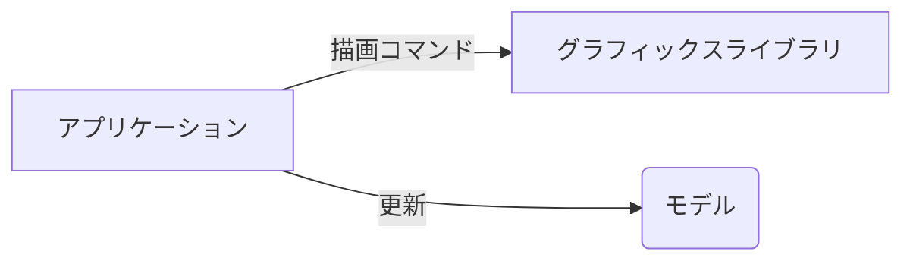

- WebGL アプリケーションの要素

  - canvas・・・シーンを描画する領域。標準の HTML5 要素のため、DOM を使用してアクセスできる。
  - オブジェクト・・・シーンを構築する 3D の物体
  - 光源・・・光源がなければ 3D 空間では何も見えない
  - カメラ・・・視界の遠近を再現するために必要な行列操作をカメラとしてモデリングする

- getParameter 関数と対応する引数を使うことで属性の現在値が確認可能

```
gl.viewport(x, y, width, height)
//x: ビューポートの左下隅のX座標。
//y: ビューポートの左下隅のY座標。
//width: ビューポートの幅。
//height: ビューポートの高さ。
```

### レンダリング

- WebGL は分割統治法を用いてオブジェクトを描画する。複雑なポリゴンはまずトライアングルやライン、ポイントなどの原始的な要素に分割される。
- WebGL は単なるラスタライザーションエンジンに過ぎない

* レンダリングパイプラインは次の通り

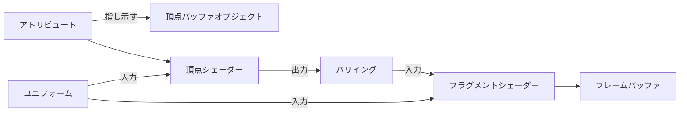

- 頂点バッファオブジェクト(VBO)：描画対象のジオメトリを定義するデータを保持(座標、法線、色、テクスチャ等)
- インデックスバッファオブジェクト(IBO)：レンダリングパイプラインが描画プリミティブを構築するときに使用する頂点同志の関係を保持。

- 頂点シェーダー：頂点アトリビュートの計算を担当
- フラグメントシェーダー：描画中のプリミティブの各ピクセル（表面）の色計算を担当

* フレームバッファ：フラグメントシェーダーによって処理されたフラグメントを保持する二次元のバッファ。レンダリングパイプラインの最終的な出力先。
* アトリビュート：頂点シェーダーで利用される入力変数。
* ユニフォーム：頂点シェーダーとフラグメントシェーダー両方で利用できる入力変数。アトリビュートと異なり、一度のレンダリングサイクル中は値が変わらない。
* テクスチャ：シャーだープログラムからアクセスできる配列状のデータ。画像データが一般的。
* バリイング：頂点シェーダーからフラグメントシェーダーにデータを受け渡すための変数。

---

- WebGL バッファを操作するための命令
  - createBuffer():新しくバッファを作成する
  - deleteBuffer(buffer):与えられたバッファーを削除する
  - bindBuffer(target, buffer):バッファオブジェクトをバインドする
  - bufferData(target, data, type):バッファにデータを設定する

---

アトリビュートと VBO の関連付け

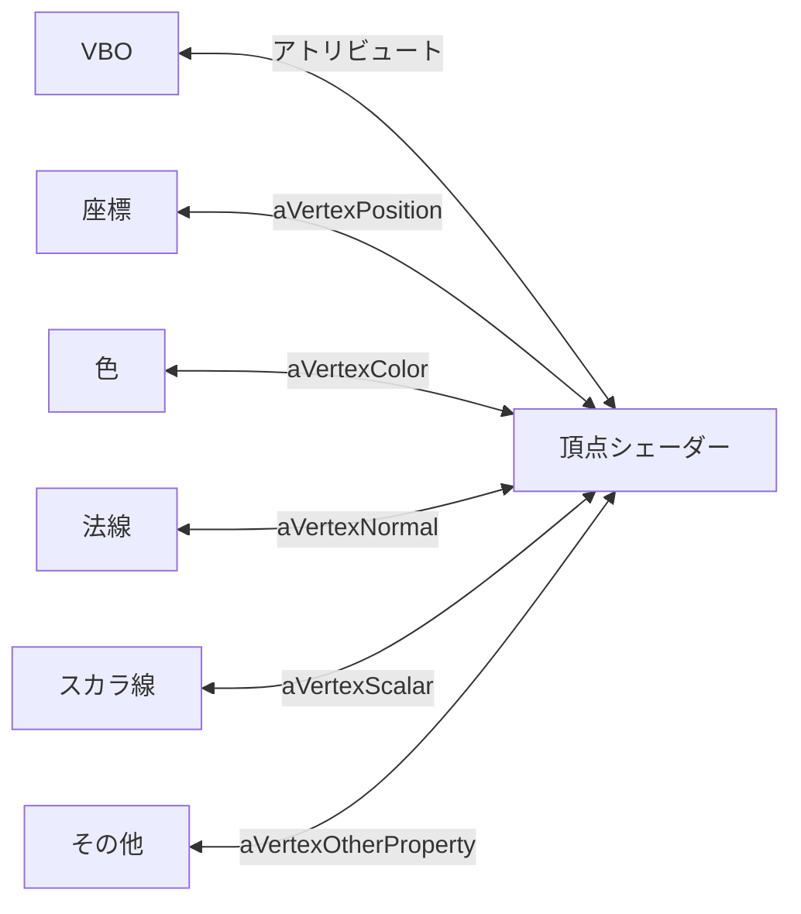

- 1.VBO をバインドする
- 2.アトリビュートを現在バインドされている VBO に関連づける
- 3.アトリビューを有効にする
- 4.VBO のバインドを解除する

---

- レンダリングには`drawArrays`と`drawElements`があるがパフォーマンスの観点から`drawElements`を使用する

- アトリビュートとユニフォームは探索コストが高いので、一度だけ行い結果を使い回す

* 頂点配列オブジェクト(VAO)はパフォーマンス向上のために必ず使用すること

* 複雑なモデルは json ファイル等からロードする

### 光源

- 点光源：光源の位置がシーンをどのように照らすかに影響を与える(室内の照明等)
- 平行光線：光源の位置に関係なく同じ照明効果をもたらす（太陽 etc)
- 法線：光を受ける面に垂直なベクトル。頂点と１対１で定義されるため、VBO としてモデル化される。

- 光源は頂点シェーダーだけでなくフラグメントシェーダーでも使用するため、ユニフォームとして扱うと良い

- シェーディング：シーン内のすべてのフラグメントの最終的な色を決定するために実行される補完の方式。色を決めるわけではない点に注意。

  - グーロー補完：最終的な色を頂点シェーダーで計算する。頂点の法線を使用し、頂点の最終的な色がバリイングを使用してフラグメントシェーダーに渡される。
  - フォン補完：最終的な色をフラグメントシェーダーで計算する。頂点の法線がバリイングでフラグメントシェーダーに渡される

- ライティングモデル：シェーディングモデルに基づいて、法線、マテリアル、光源をどのように組み合わせて最終的な色を得るか定義する。反射モデルとも呼ばれる。

  - ランバート反射モデル：さまざまな方向に反射する拡散反射。面の法線と反転した入射光の方向ベクトルの内積。
  - フォン反射モデル：物体表面の光線の反射を環境光、拡散反射、鏡面反射の３種類の反射の合成をみなす。

- 環境光：シーン内の散乱光を表す

* OpenGL ES Shading Language(ESSL)はシェーダーを記述するための言語

  - in：シェーダーの入力変数。頂点シェーダーに渡す場合はアトリビュートと呼ぶ。フラグメントシェーダーに渡す場合はバリイングと呼ぶ。
  - out:シェーダーの出力変数。頂点シェーダーの場合はバリイング。フラグメントシェーダーの場合は最終的なフラグメントの色を返す変数。

---

- ライティング戦略の選択

  |              | ランバート反射 | フォン反射               |
  | ------------ | -------------- | ------------------------ |
  | グーロー補完 | 拡散反射       | 環境光+拡散反射+鏡面反射 |
  | フォン補完   | 拡散反射       | 環境光+拡散反射+鏡面反射 |

---

- WebGL プログラムが大きくなると、複数のプログラムを用意しておき、gl.useProgram 関数を使用してアプリケーション内で切り替えて使用するため、プログラム自身のプロパティとして後リビューやユニフォームを追加すると良い

### カメラ

- WebGL にはカメラオブジェクトはない

#### モデル変換

- オブジェクト座標系：頂点座標が定義される空間
- ワールド座標系：全てのオブジェクト共通の原点を持つ空間。オブジェクト同志の位置関係が分かる。

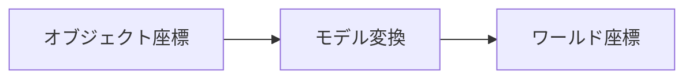

#### ビュー変換

- ビュー変換：座標系の原点をビューの原点に移動する。ビューの原点はワールドの原点に対する視点またはカメラの位置。

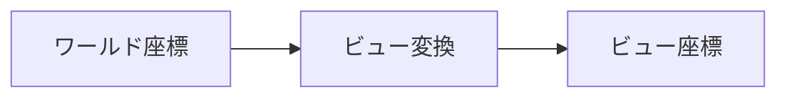

#### 投影変換

- 投影変換：ビュー空間のどの範囲を描画するかや、コンピュータの画面にそれらをどのように対応づけるかを指定

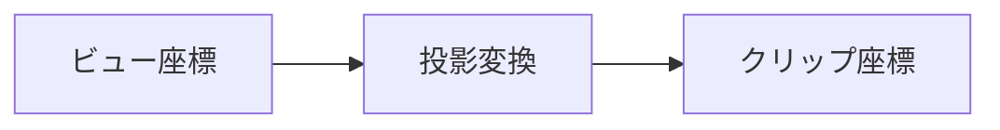

正規化デバイス座標：特定のハードウェアに依存しない中間的な座標系

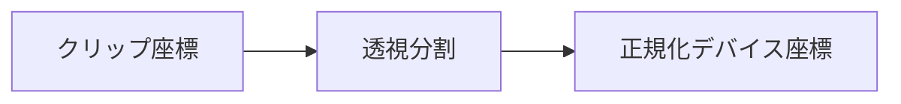

#### ビューポート変換

- ビューポート変換：正規化デバイス座標をビューポート(canvas)座標に変換する

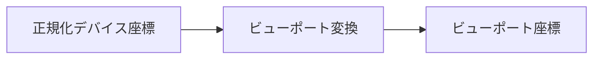

- 理論

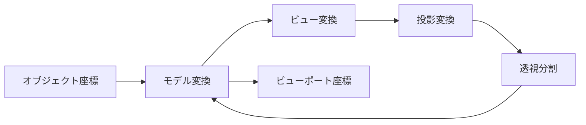

- WebGL

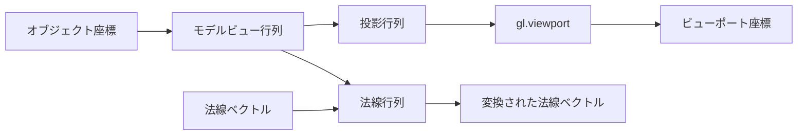

- モデルビュー行列：モデル変換とビュー変換を１つにまとめたもの。この行列ろ頂点座標を掛け合わせると、ビュー座標になる
- 法線行列：モデルビュー行列の逆行列を転置すると得られる。この行列を法線ベクトルに適用した場合、面に対して垂直が維持される。
- 投影行列：投影変換と透視分割を１つにまとめたもの

#### 基本的なカメラタイプ

- 軌道カメラ：ワールドの中心に置かれた対象オブジェクトをどの角度から眺めるかを決定し、そのあとで距離を調整（平行移動）して好きな場所を眺めることができる

- 追跡カメラ：ワールド原点を中心に回転するのではなく、カメラの軸に対して回転する

## アニメーション

- ワールド行列：モデルの頂点の座標をワールド空間座標に変換する
- カメラ行列：ワールド内のカメラの位置を定める行列
- 投影行列：空間の視推台をクリップ空間に変換する行列
- ローカル行列：グラフのノードのローカルな空間を表す

* パラメトリック曲線：与えられた時間の正確な位置は分からないが、動きを記述する式が分かっている式（時間に依存する等）

* ジオメトリインスタンシング：render 関数を一度呼び出すだけで、特定のメッシュの同じインスタンスを、異なるシェーダーアトリビュートを使用して複数個描画できる

#### 補完

- 線形補完：オブジェクトの位置の開始点と終了点の直線状を補完ステップ数に応じて移動する
- 多項式補完：人数の数の制御店を通る軌跡に沿って、開始点から終了点まで移動する
- B スプライト補完：制御店がオブジェクトの軌跡の外側にある。なめらかな軌跡をより少ない制御点で生成できる

### 色、奥行、半透明

- 光源のプロパティを個別のユニフォームで取り扱うとコードが冗長になり、メンテしづらくなるため、ユニフォーム配列を使う
- 深度：フラグメントがカメラからどれだけ離れているかを表す情報

レンダリングパイプライン

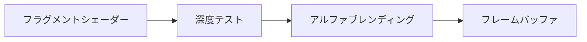

- カリング：オブジェクトの背面または前面のみを描画できる

### テクスチャ

- テクスチャマッピング：物体表面に画像を描画して、ジオメトリのより細かな部分を表現する手法
- テクスチャ座標：頂点に対応するテクスチャ画像上の位置を示す２要素の浮動小数点数ベクトル
  テクスチャ座標は 0 から 1 の範囲に正規化されるため、中心は常に(0.5, 0.5)になる

* テクセル：テクスチャのそれぞれのピクセル

#### フィルターモード

- NEAEST:常に中心がサンプリング点に最も近いテクセルの色を返す
- LINEAR:サンプリング点に近い 4 つのピクセルの色の重み付け平均を返す。NEAEST より計算量が多くなる。

- ミップマップ：テクスチャの半分の大きさのコピーを繰り返し保持して、レンダリング時にもっとも近いサイズのコピーからサンプリングする。ジッターを軽減できる。
  - NEAEST_MIPMAP_NEAEST:画面上のテクスチャのサイズに最も近いミップマップを選択し、NEAREST アルゴリズムを使用してサンプリング
  - LINEAR_MIPMAP_NEAREST:画面上のテクスチャのサイズに最も近いミップマップを選択し、LINEAR あるごリムを使用してサンプリング
  - NEAEST_MIPMAP_LINEAR:画面上のテクスチャのサイズに最も近い２つのミップマップを選択し、両方から NEAREST アルゴリズムでサンプリング。その上でサンプリングした２つの色の重み付け平均を返す
  - LINEAR_MIPMAP_LINEAR:画面上のテクスチャのサイズに最も近い２つのミップマップを選択し、両方から LINEAR アルゴリズムでサンプリング。その上でサンプリングした２つの色の重み付け平均を返す

#### テクスチャラッピング

- CLAMP_TO_EDGE:１より大きいテクスチャ座標をすべて１に、０より小さい座標はすべて０に丸めて、値を０－１の範囲にクランプする
- REPEAT:テクスチャの正数部分を無視する
- MIRRORED_REPEAT:座標の整数部分が偶数なら、テクスチャ座標は REPEAT と同じになる。正数部分が奇数なら、結果は１から座標の小数部分を引いた座標になる

- マルチテクスチャ：一度のドローコールで複数のテクスチャにアクセスできる機能

### ピッキング

- オフスクリーンレンダリング：ディスプレイではなくメモリ上にレンダリングすること
- ピッキング：オフスクリーンレンダリングで各オブジェクトに単色または一意の ID を割り当て、クリックしたオブジェクトのヒット判定を行う

### WebGL アプリケーション

- WebGL に取り込むモデルは Blender で作成したモデルが取り込める。

### 高度なテクニック

- ポストプロセッシング：レンダリングの結果として得られるシーンの画像をシェーダーを通じて再描画することで、シーンに視覚効果を追加するプロセス（グレースケール、色反転等）
- 法線マッピング：物体表面の法線をテクスチャマップとして保存してオブジェクトのライティング計算に使用することで、詳細なジオメトリと同等の反射をローポリゴンモデル上で実現する（リアルタイム 3D アプリケーションで人気）

#### WebGL2 の新機能

- インスタンシング：結果がほとんど変わらない複数回の描画コマンドを一度にまとめて実行。メモリ消費や API 呼び出し回数を抑えられる。
- 標準の圧縮テクスチャ：WebGL1 のハードウェア依存の圧縮と異なり、ハードウェア非依存の圧縮フォーマットが使用できる
- ユニフォームバッファオブジェクト：大量のユニフォームをまとめて設定できるため高速

* トランスフォームフィードバック：WebGL1 ではバッファの値はシェーダーからアトリビュートを通じて読み込むしかなかったが、WebGL2 では頂点シェーダーの処理結果をバッファに書き込めます
* 深度テクスチャ：WebGL1 は深度テクスチャがないが WebGL2 では存在する
* マルチレンダーターゲット：WebGL2 ではシェーダーから一度に複数のバッファに書き込めます
* クエリオブジェクト：GPU 内部を詳しく調べるための新しい手段。統計情報の出力やジオメトリの深度テスト状況など確認できる。

### さらなる旅路

#### ライブラリ

- TWGL
- Regl
- StackGL
- Three.js
- Babylon.js

* A-Frame

#### ゲームエンジン

- Unity
- PlayCanvas

#### 視覚的回帰テスト

- ビジュアル回帰テストはスクリーンショットをキャプチャして、それらを元の画像と比較することで回帰テストを実現する

#### 3D 再構築

- 3D 再構築：画像から 3D モデルを作成するプロセス。フォトグラメトリを使用する。
