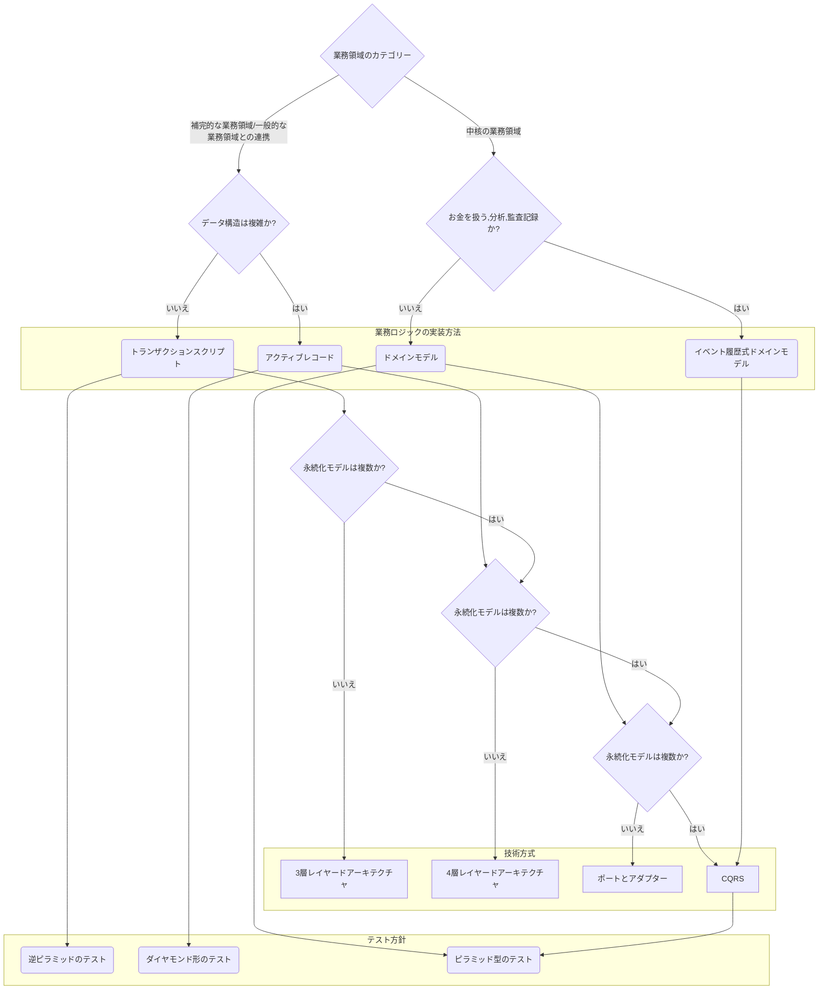

### 定義

| 言語                 | 従来の訳語       | 本書の訳語             |
| -------------------- | ---------------- | ---------------------- |
| domain               | ドメイン         | 事業活動または事業領域 |
| subdomain            | サブドメイン     | 業務領域               |
| domain logic         | ドメインロジック | 業務ロジック           |
| domain event         | ドメインイベント | 業務イベント           |
| ubiquitos language   | ユビキタス言語   | 同じ言語               |
| shared kernel        | 共有カーネル     | モデルの共有           |
| anticorruption layer | 腐敗防止層       | モデル変換装置         |
| separate way         | 別々の道         | 互いに独立             |

- 値型・・・値は不変とする。フィールド値の組み合わせによって識別されるオブジェクト(例:Color)。使えるときはなるべく使う。

* エンティティ・・・個々のインスタンスを特定するための ID を持つ(例:人。名前だけでは個人が特定できない)。

- 集約・・・エンティティの一種。データの一貫性を保証する役割。１つのトランザクションのみ管理する。

* サーガ・・・開始から終了まで長く続く業務プロセス。システムの一貫性を保証するための補償アクションを実行する。業務イベントとコマンドを対応させる仕組み。
* プロセスマネージャ・・・業務ロジックが中心となる複雑な業務プロセスを実装する方法。

- 業務イベント・・・事業活動で発生する重要な出来事。

* トランザクションスクリプト・・・データを操作する手続きの一部として業務ロジックを記述します。
* アクティブレコード・・・トランザクションスクリプトと同様に単純な業務ロジックの実装方法。ただし、複雑なデータ構造を操作できる。
* ドメインモデル・・・ロジックとデータの両方を一体化させた、事業活動を表現するオブジェクトモデル
* イベント履歴式ドメインモデル・・・集約のライフサイクルを業務イベントでモデル化する。
* 共用サービス・・・区切られた文脈のモデルと他のコンポーネントと連携するためのモデルを分離する
* モデル変換装置・・・利用する側の区切られた文脈の局所的な複雑さと、システム全体の複雑さの両方を軽減する
* イベント駆動型アーキテクチャ・・・システムのコンポーネント間で、イベントメッセージを非同期でやり取りする技術方式。
* データメッシュ・・・分析計データにおけるドメイン駆動設計

### 業務領域

| カテゴリー | 競争優位 | 複雑さ | 変化   | 実装                       | 課題の特徴         |
| ---------- | -------- | ------ | ------ | -------------------------- | ------------------ |
| 中核       | 〇       | 複雑   | 多い   | 社内                       | 複雑で興味深い     |
| 一般       | ×        | 複雑   | 少ない | 製品購入や外部サービス利用 | 既存の解決策がある |
| 補完       | ×        | 単純   | 少ない | 社内または外部委託         | 明確               |

### 実装方法とテスト方針の判定方法

